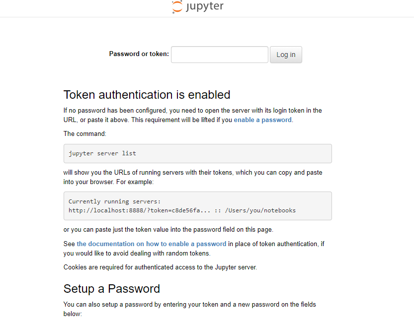

# studyML

https://suchu3.github.io/studyML/ のリポジトリ

# ハンズオン実行環境準備

DockerコンテナもしくはGoogle Colaboratory にて、ハンズオンのノートブック実行環境を準備します。

## Dockerコンテナを使用する場合

Docker Desktop がインストールされていることを前提とします。
また、動作確認は以下の環境にて行っています。
- Windows 10
    - Docker version 20.10.10
- macOS Catalina
    - Docker version 20.10.11

### リポジトリをクローン

ここではデスクトップにクローンを作成するとします。
```
cd ~/Desktop
git clone https://github.com/suchu3/studyML.git
```

### コンテナネットワークを作成

2つのコンテナ間で通信を行うハンズオンがあるため、コンテナのブリッジネットワークを作成しておきます。

```
docker network create deploy-handson-network
```

### イメージをビルド

まず、リポジトリ中のdockerディレクトリに移動します。
```
cd ~/Desktop/studyML/docker
```

その状態でビルドコマンドを実行します。
```
docker build -t studyml_image .
```

### コンテナを起動

イメージのビルド後、次のコマンドでイメージからコンテナを起動します。
```
docker run --net deploy-handson-network --name studyml_container -itd -v ~/Desktop/studyML/handson:/handson -p 3000:8888 studyml_image
```

### Jupyter Lab を起動

次のコマンドで起動したコンテナの中に入ります。
```
docker exec -it studyml_container bash
```

その状態でJupyter Lab の起動コマンドを実行します。
```
jupyter-lab --ip 0.0.0.0 --allow-root
```

次のような表示が出れば起動成功です。  

赤枠内の?token=以降の文字列をコピーしておきます。

### ブラウザ表示

chromeの新しいタブを開いて、アドレスバーに以下を入力します。
```
http://localhost:3000
```

次のような画面が表示されるので、コピーしておいた?token=以降の文字列を入力します。  


次のような画面に切り替われば成功です。  
画面左のディレクトリ一覧からhandsonをダブルクリックします。  
  

その先でsrcディレクトリをダブルクリックします。  
  

ハンズオン用のノートブックをダブルクリックして開きます。
  

以上でDockerコンテナを使用したハンズオン環境準備は完了です。  

### 終了時
Jupyter Lab を終了するときはターミナル上でCtrl+C を押下します。  
本当に終了するか確認されるのでy を入力してEnter を押下します。  

コンテナから抜けるときは次のコマンドを入力します。
```
exit
```

コンテナを停止させるときは次のコマンドを入力します。
```
docker stop studyml_container
```

コンテナを削除するときは次のコマンドを入力します。
```
docker rm studyml_container
```

ビルド済みのイメージを削除するときは次のコマンドを入力します。
```
docker rmi studyml_image
```

## Google Colaboratory を使用する場合

Googleアカウントを所有していることを前提とします。  

### 資材をアップロード

Googleドライブにリポジトリの/handsonディレクトリ配下をまるっとアップロードします。
  

### Google Colaboratory でノートブックを開く

アップロードしたhandsonフォルダ > srcフォルダとダブルクリックします。
  

開きたいノートブックを右クリックしてアプリで開く > Google Colaboratory を選択します。  
  
アプリで開くを選択してもGoogle Colaboratory が候補に出てこない場合は、アプリを追加からGoogle Colaboratory を検索してください。  
次のような画面が表示されれば正常に開けています。  
  

### ドライブをマウント

しかし、このまま実行したのではGoogleドライブにアップロードしたcsvファイルを読み込めません。  
  
Googleドライブに読み書きできるようにするため、Google Colaboratory の実行環境をGoogleドライブにマウントさせます。  
まず、画面左のファイルマークをクリックしてメニューを開き、3つ並んだアイコンの一番右をクリックします。  
  

次のコードセルがノートブックに挿入されます。  
  

GUIから挿入せず、直接書き込んでもOKです。  
```
from google.colab import drive
drive.mount('/content/drive')
```

挿入されたコードセルを実行します。  
確認を求められるので、Googleドライブに接続を選択します。
  

接続先Googleドライブのアカウントを選択します。  
  

初めて行う場合はチェックボックスが表示されるので、全てチェックを入れて一番下のContinue を押下します。  
  

2回目以降の場合は確認メッセージだけが表示されるので、一番下のContinue を押下します。  
  

次のように出力されればGoogleドライブへのマウント完了です。
  

### ワークディレクトリを移動

以下のコマンドをコードセルに打ち込んでワークディレクトリを確認します。  
```
%pwd
``` 

  

デフォルトではGoogle Colaboratory は/contentディレクトリで実行されています。  
/contentディレクトリは一番上の階層です。  
Googleドライブは/content/driveディレクトリの下にマウントされているので、ノートブックを実行する前にワークディレクトリを移動しておきます。  
ワークディレクトリの移動は以下のコマンドで行います。  
```
%cd /content/drive/MyDrive/handson/src
```

  

ワークディレクトリ移動後、そのままコードを実行するだけでGoogleドライブからcsvファイルを読み込みできるようになります。  
  

以上でGoogle Colaboratory を使用したハンズオン環境準備は完了です。