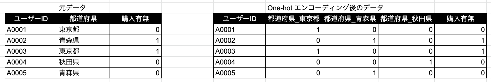
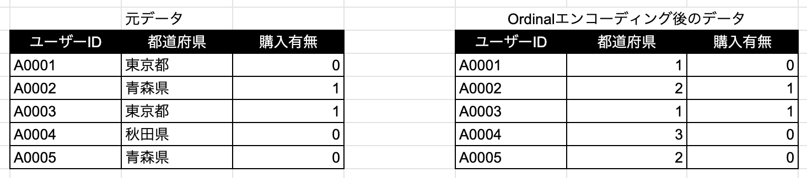

# データ前処理
{: .no_toc }

  

    Table of contents
  

  {: .text-delta }
1. TOC
{:toc}

---

機械学習の文脈でのデータ前処理とは、アルゴリズムが受け取れる・正常に動作することを目的として、フィッティング前にデータを整形しておくこと。  
例えば次のような処理。  
- 勾配降下法が収束するように数値のスケールを揃える
- テキストや画像のデータを数値に変換する

中には精度向上を目的とした高度なデータ前処理を行うこともあるが、本資料では扱わない。  
また、JSON形式のデータをアンネストしたり、ELT処理を実行したりすることもデータ前処理と言えるが、本資料では扱わない。

## 数値変数の前処理

- 整数、小数問わず、数値のデータに対する処理
- 対象となるデータ型はinteger, float, doubleなど
- 主な目的は損失関数の最小化問題を収束させること
- したがって、勾配を計算する線形アルゴリズムやニューラルネットワークでは必須
- 一方、数値の大小関係に基づいて分割していくツリー系アルゴリズムでは、やってもやらなくても変わりない  

### 標準化 (Standardization)

平均$0$、分散$1$になるようスケーリングする。  
一番基本的な手法。  
変換前の特徴量を$x$として、変換後を$x'$とすると

$$
x' = \frac{x-\bar{x}}{\sigma}
$$

ただし、$\bar{x}$は$x$についての全サンプルの平均、$\sigma$は$x$についての全サンプルの標準偏差とする。

### 対数変換

対数関数に突っ込む。  
$0$以上の値をとり、裾の長い分布の変数の場合に有効。  
&rarr; 正規分布に近づくため  
&rarr; 年収や貯蓄額などの金額系の変数  

$$
x' = \log(x)
$$

## カテゴリ変数の前処理

- 真偽値、テキスト問わず、カテゴリを表すデータに対する処理
- 対象となるデータ型はboolean, char, varcharなど
- CatBoostを除き、大多数のアルコリズムは数値以外のデータ型を直接扱うことができない
- 主な目的はアルゴリズムが扱えるデータ型にしておくこと
  - つまりintegerに変換する
- したがって、線形モデルでもツリー系アルゴリズムでも基本的に必要
  - 線形アルゴリズムではOne-hot エンコーディング
  - ツリー系アルゴリズムではOrdinal エンコーディング

### One-hot エンコーディング

全カテゴリ値をダミー変数化する。  

### Ordinal エンコーディング

登場した順にカテゴリ値に数値を割り当てる。  

