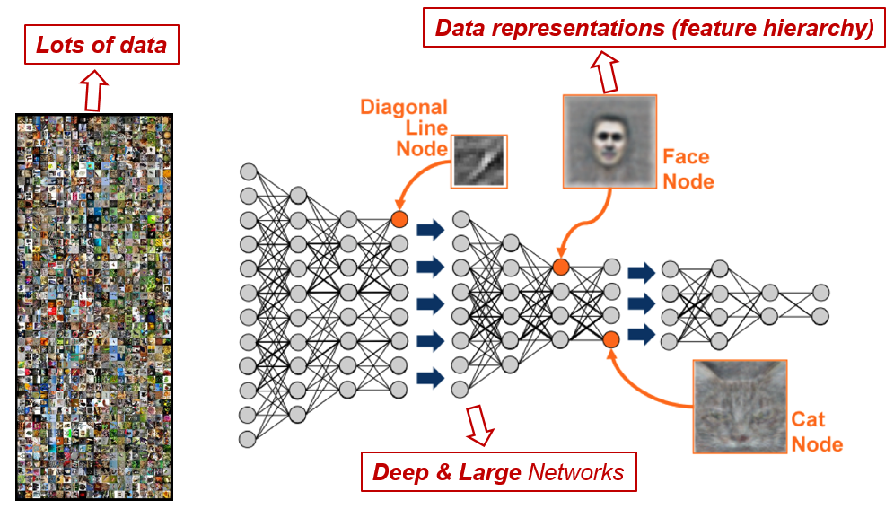
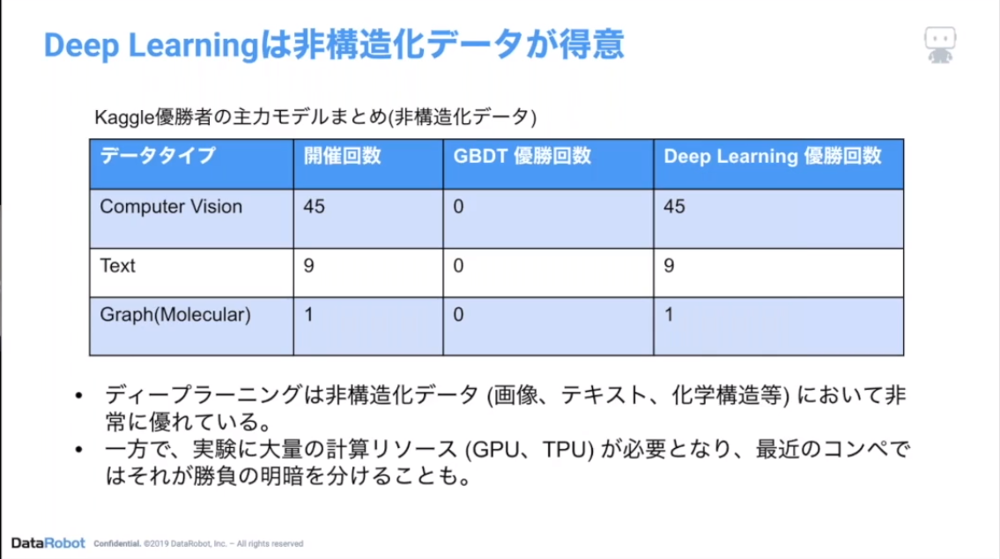
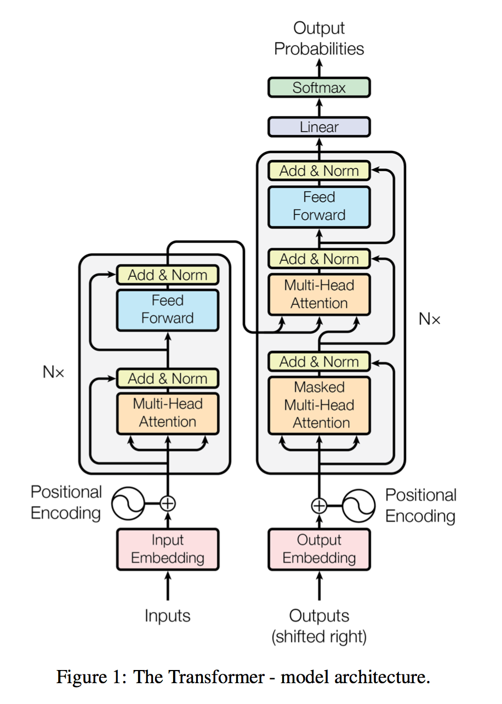

# ディープラーニングさわり
{: .no_toc }

  

    Table of contents
  

  {: .text-delta }
1. TOC
{:toc}

---

## ニューラルネットワーク

ディープラーニングとは隠れ層を数十〜数百に深くしたニューラルネットワークのこと。  
単純に深くしただけだと様々な問題が出てくるので、色々と工夫されている。  
  

## なぜディープラーニングが注目されているのか

- 表現学習 (Representation Learning)
    - 特徴量エンジニアリングで人が特徴量を作り出さなくても良い  
  
    - ディープラーニングは自ら特徴を学習することができる
  

- 非構造化データに強い  
  
  
  
  

出典：DataRobot Community [アーカイブ] DL入門とDataRobot Visual Artificial Intelligence(AI)

## 有名なネットワーク

4系統のネットワークに分けられる。
- FNN (Feed-forward Neural Network)  
    &rarr;  一方通行のネットワーク  
    - DNN(Deep Neural Network),  ANN (Artificial Neural Network), MLP (Multi Layer Perceptron)  
        &rarr; いずれも全結合層を深くした単純なネットワーク  
        - 全ての基本
        - シンプルすぎてこれ単体で実務で使うことはない  
  

- RNN (Recurrent Neural Network)  
    &rarr; 系列データを扱うネットワーク  
    &rarr; 自然言語、音声分野で用いられる
  
    - Simple RNN  
        &rarr; 時点$t-1$の出力を時点$t$の入力に含める  
        - 時間軸が進むにつれてどんどん更新されるので時点$t-10$とかの情報が考慮されない  
        &rarr; 記憶能力が弱い  
        - 教科書を開くと最初に出てくるが、実務では使われない
    - LSTM (Long Short Term Memory)  
        &rarr; 長期記憶と短期記憶を持たせたネットワーク  
        - Transformer登場以降、実務ではあまり使われない
    - GRU (Gated Reccurent Unit)  
        &rarr; 長期記憶を持たせたネットワーク  
        - Transformer登場以降、実務ではあまり使われない  
  

- CNN (Convolutional Neural Network)  
  
    &rarr; 畳み込み層 (Convolution Layer) と呼ばれる層で特徴抽出を行う  
    &rarr; 画像分野で用いられる  
    - シンプルなCNNは実務では使われない  
    - RNN同様、今後Transformer系にとって変わられるかも
    - 実務で使われるCNNの例
        - EfficientNet
        - ResNet  
  

出典：He et al (2015) "Deep Residual Learning for Image Recognition"

  

- Transformer系  
    &rarr; Attension機構と呼ばれる層でどこに注目すれば良いかを学習するEncoder-Decoderモデル  
    &rarr; 元々は機械翻訳で登場したが、色々なタスクでState of the Art  
    &rarr; 自然言語の分野ではRNNにとって変わった  
    &rarr; 今後、画像分野でもCNNにとって変わるかもしれない  
    - Transformer
    - GPT
    - BERT
    - Vision Transformer (ViT)  
  

出典：Vaswani et al (2017) "Attension Is All You Need"

  