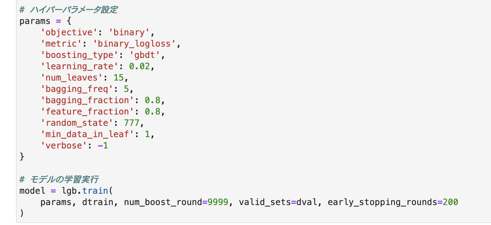
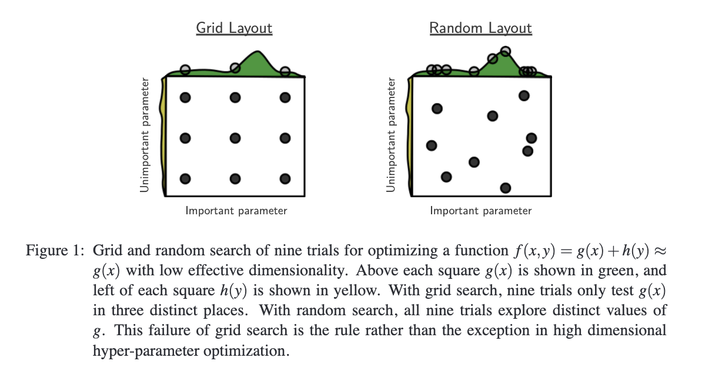

# ハイパーパラメータ
{: .no_toc }

  

    Table of contents
  

  {: .text-delta }
1. TOC
{:toc}

---

## ハイパーパラメータとは

ハイパーパラメータとは、フィッティングを行う前に人が決めておくパラメータのこと。  
例えばLightGBMでモデルを作ったコードの以下の部分。  

イメージとしては、アルゴリズムをより良くデータにフィッティングしていくための調節ネジ。  
この調節ネジを回して一番精度が良くなる状態に持っていくことをハイパーパラメータチューニングという。  
ハイパーパラメータチューニングには、大きく2つの流派が存在する。  
1. 職人派  
  各調節ネジの役割を理解して人の手で調整する。
2. 自動探索派  
  ある程度網羅的に試して、結果的に一番良くフィッティングできた値を採用する。

現在主流となっているのが自動探索派で、「ある程度網羅的に試す」ための主な手法が次の3つ。  
- グリッドサーチ
- ランダムサーチ
- ベイズ最適化

3つの中で現在一番よく使われているのは、おそらくベイズ最適化。

## グリッドサーチ

出典：Bergstra and Bengjo (2012) "Random Search for hyper-parameter optimization"

- 調整したい各ハイパーパラメータに関して適当な値をピックアップする
- ピックアップしたハイパーパラメータの値について、全ての組み合わせパターンでモデルを作成する
- 作成した全モデルについて精度指標を計算する
- 一番精度指標の良かったモデルで使用していたハイパーパラメータの組み合わせを採用する

**グリッドサーチのメリット**
- 並列化が簡単
- 発想が単純なので理解しやすい

**グリッドサーチのデメリット**
- 調整したいハイパーパラメータが多い、もしくは候補としてピックアップしたい値が多い場合は組み合わせ爆発するので、全て試すのは非現実的
- ランダムサーチに比べて無駄な試行が増えがち

**グリッドサーチが有効な場面**
- 調整したいハイパーパラメータが少ないくて、網羅的に探索したいとき

## ランダムサーチ

- 調整したい各ハイパーパラメータの値をランダムにピックアップする
- そのハイパーパラメータの組み合わせでモデルを作成する
- 作成したモデルの精度指標を計算する
- 新たに各ハイパーパラメータのをランダムにピックアップする
- そのハイパーパラメータの組み合わせでモデルを作成する
- 作成したモデルの精度指標を計算する
- これを延々繰り返して、最終的に一番精度の良かったモデルで使用していたハイパーパラメータの値の組み合わせを採用する

**ランダムサーチのメリット**
- 並列化が簡単
- グリッドサーチに比べて効率的に探索できる

**ランダムサーチのデメリット**
- 調整したいハイパーパラメータが多い場合はやはり計算量が増えるため、厳しい場合がある

**ランダムサーチが有効な場面**
- 調整したいハイパーパラメータが多くて、ある程度効率的に探索したいとき

## ベイズ最適化

- 通常、機械学習モデルとは特徴量をインプットとして、連続値なり確率なりをアウトプットとするモデル
- これを、各ハイパーパラメータの値をインプットとして、そのときの精度指標をアウトプットとするような何らかの関数に見立てる
- ハイパーパラメータの探索を、見立てた関数の出力を最小化（または最大化）させる問題として読み替える
  - 大きければ大きいほど良い精度指標の場合は最大化問題になる
  - 小さければ小さいほど良い精度指標の場合は最小化問題になる
  - ただし、最大化問題は符号を反転させれば最小化問題として扱える
- 読み替えた最小化問題を解けば最適なハイパーパラメータが求まる
  - 線形モデルの最小化問題を解くときは勾配降下法やその発展手法を用いた
  - しかし、今回の問題は非常に複雑な関数の形になるのでこれらの手法は使用できない
  - そこで使用するのがベイズ最適化と呼ばれる手法
  - 具体的には以下のようなアルゴリズムを用いた最適化手法の総称
    - ガウス過程
    - TPE (Tree-structured Parzen Estimator)
- ベイズ最適化を行うときによく使われるライブラリ
  - HyperOpt
  - Optuna

**ベイズ最適化のメリット**
- 総当たりではなく、重要そうな組み合わせを重点的に探索できるのでランダムサーチよりも効率的

**ベイズ最適化のデメリット**
- 並列化が難しい

**ベイズ最適化が有効な場面**
- 調整したいハイパーパラメータが多くて、効率的に探索したいとき

## 調整対象ハイパーパラメータ

ハイパーパラメータの中にはチューニングすることに意味のないものもある。  

- ランダムシード
  - random_state
  - random_seed
- 標準出力するログのレベル
  - verbose
  - verbosity
- 勾配降下法/勾配ブースティングの学習率
  - learning_rate
  - eta
- 勾配降下法/勾配ブースティングの繰り返し回数
  - num_boost_round
  - n_estimators

なお、ハイパーパラメータの名前はライブラリによって異なっていたり、同じライブラリでも複数のエイリアスを持っていたりする。  
そのため、使用するライブラリの公式ドキュメントは必見。
