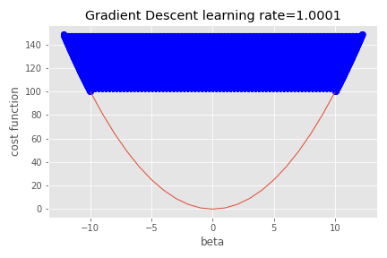

# 線形回帰
{: .no_toc }

  

    Table of contents
  

  {: .text-delta }
1. TOC
{:toc}

---

政府統計e-Statで公開されている市町村別データで遊びながら線形回帰モデルを作成する。

- データソース
    - 政府統計e-Stat
- データ内容
    - 日本国内の1,839市町村別データ
- データ項目
    - 総人口数
    - 完全失業者数
    - 刑法犯認知件数
- 調査年
    - 2005年

作成するモデルは以下の通り。

- 仮説
    - 治安の悪さと失業者の数には関係がある
    - 刑法犯認知件数を$crime$ 完全失業者数を$unemp$とする
\\[
\begin{align}
crime_i = \beta_0 + \beta_1unemp_i + \varepsilon_i \cr
\varepsilon_i \sim N(0, \sigma^2)
\end{align}
\\]

- 損失関数
    - MSE
\\[
\begin{align}
J(\beta_0, \beta_1) = \frac{1}{n}\sum_{i=1}^{n} (crime_i - \beta_0 - \beta_1unemp_i)^2
\end{align}
\\]

- モデルを作るには
    - 手元にあるのは日本国内1,839市町村のデータ
    - つまりサンプルサイズ$n=1839$
    - このデータを使って$J(\beta_0, \beta_1)$を最小にするようなパラメータ$\beta_0, \beta_1$を求めれば良い  
    &rarr; 最小二乗法もしくは勾配降下法

## 最小二乗法

最小二乗法とは正規方程式と呼ばれる次の方程式を解いて、$J(\beta_0, \beta_1)$を最小にするようなパラメータ$\beta_0, \beta_1$を求める方法。  
\\[
\beta = (X^TX)^{-1}X^Ty
\\]
ただし、$X$は説明変数行列、$y$は目的変数ベクトル、$\beta$はパラメータベクトルを表す。  
また、右上の添字$T$は転置行列、右上の添字$-1$は逆行列を表す。  

- 計算上の注意点
    - 行列$X^TX$が逆行列を持たない場合は正規方程式が解けない  
    &rarr; 行列$X^TX$は正則条件（逆行列を持つための条件）を満たす必要がある  
    &rarr; マルチコがあると正則条件を満たさない  
    &rarr; だからマルチコが嫌われる

正規方程式の導出は以下の通り。  
$(unemp_1, crime_1), (unemp_2, crime_2), \dots , (unemp_n, crime_n)$という$n$組のデータについて  
\\[
\begin{align}
crime_i = \beta_0 + \beta_1unemp_i + \varepsilon_i \cr
\varepsilon_i \sim N(0, \sigma^2)
\end{align}
\\]
という線形回帰モデルを仮定している。  
ここで、記法として行列表記を取り入れる。  
\\[
y = 
\begin{pmatrix}
crime_1 \cr 
crime_2 \cr
\vdots \cr
crime_n
\end{pmatrix}
\quad
x=
\begin{pmatrix}
1 & unemp_1 \cr 
1 & unemp_2 \cr
\vdots & \vdots \cr
1 & unemp_n
\end{pmatrix}
\quad
\beta =
\begin{pmatrix}
\beta_0 \cr 
\beta_1
\end{pmatrix}
\quad
\varepsilon = 
\begin{pmatrix}
\varepsilon_1 \cr 
\varepsilon_2 \cr
\vdots \cr
\varepsilon_n
\end{pmatrix}
\\]
のように表記すれば、モデルは次のように行列表記できる。  
\\[
\begin{align}
y = X\beta + \varepsilon \cr
\varepsilon \sim N_n(0, \sigma^2I_n)
\end{align}
\\]
このときの$X$を説明変数行列または計画行列、 $y$を目的変数ベクトルまたはターゲットベクトル、$\beta$を回帰係数ベクトルまたはパラメータベクトルと呼ぶ。  

次に最小化したい損失関数も行列表記する。  
\\[
e = y - X \beta
\\]
とおくと、
\\[
e =
\begin{pmatrix}
crime_1 \cr 
crime_2 \cr
\vdots \cr
crime_n
\end{pmatrix} -
\begin{pmatrix}
1 & unemp_1 \cr 
1 & unemp_2 \cr
\vdots & \vdots \cr
1 & unemp_n
\end{pmatrix}
\begin{pmatrix}
\beta_0 \cr 
\beta_1
\end{pmatrix}=
\begin{pmatrix}
crime_1 - \beta_0 - \beta_1unemp_1 \cr
crime_2 - \beta_0 - \beta_1unemp_2 \cr
\vdots \cr
crime_n - \beta_0 - \beta_1unemp_n
\end{pmatrix}
\\]
なので、損失関数は
\\[
\begin{align}
J(\beta) &= \frac{1}{n}e^Te \cr
&= \frac{1}{n}(y-X\beta)^T(y-X\beta) \cr
&= \frac{1}{n}(y^T - \beta^T X^T)(y-X\beta) \cr
&= y^Ty -2\beta^TX^Ty + \beta^TX^TX\beta
\end{align}
\\]
となる。これを$\beta$の各要素について偏微分して$=0$とおくと
\\[
\frac{\partial}{\partial \beta}J(\beta) = -2X^Ty + 2X^TX\beta = 0
\\]
を得る。したがって損失関数$J(\beta)$を最小化する条件は
\\[
X^TX\beta = X^Ty
\\]
で与えられ、見やすくするために式変形すると
\\[
\beta = (X^TX)^{-1}X^Ty
\\]
となる。以上で正規方程式が導出された。  

## 勾配降下法

もう一つの代表的手法が勾配降下法。  
勾配降下法とは次のような計算を繰り返してパラメータ$\beta_0, \beta_1$を更新することで、$J(\beta_0, \beta_1)$を最小にするようなパラメータ$\beta_0, \beta_1$を探し出すアルゴリズム。  
パラメータの数を$j$、学習率を$\alpha$として  
\\[
\beta_j := \beta_j - \alpha \frac{\partial}{\partial \beta_j} J(\beta_0, \beta_1)
\\]

ただし、$:=$は右辺を左辺に代入する演算子。  
また、$\frac{\partial}{\partial \beta_j} J(\beta_0, \beta_1)$は$J(\beta_0, \beta_1)$の$\beta_j$についての偏微分を表す。  
各$j$についての偏微分を全て並べたベクトルを勾配と呼ぶ。  

直感的説明は以下の通り。  

- 仮に損失関数がこのような形をしていたとする  
  
- 損失関数が最小値をとるのは$\beta=0$のときで一目瞭然
- この損失関数を谷に見立てる
- 谷の斜面から一歩一歩下っていけば、いつか必ず谷の底に着くはず
- 下るときの一歩の歩幅が学習率$\alpha$
- 合計何歩下るかの最大歩数が繰り返し数  
&rarr; 下ることをパラメータ$\beta_0, \beta_1$の更新に例えている

実際に歩幅を変えながら下ってみる。  

- 学習率$\alpha=0.1$で下っていったときの軌跡  
  
- 学習率$\alpha=0.3$で下っていったときの軌跡  
&rarr; 歩幅が大きくなったので早く谷の底に着く  
  
- 学習率$\alpha=0.5$で下っていったときの軌跡  
&rarr; 歩幅が更に大きくなったので一歩で谷の底に着く  
  
- 学習率$\alpha=0.8$で下っていったときの軌跡  
&rarr; 歩幅が大きくなりすぎて谷の底を跨ぎつつも、最終的には何とか谷の底に着く  
  
- 学習率$\alpha=1.0$で下っていったときの軌跡  
&rarr; 歩幅が完全に大きくなりすぎて、反対斜面との間を行ったり来たりしかできない  
  
- 学習率$\alpha=1.0001$で下っていったときの軌跡  
&rarr; 足がデカすぎて谷の底へ行けない、歩けば歩くほど谷の上へ行ってしまう  
&rarr; 「発散」と呼ばれる状態  
  

きちんと計算するためには損失関数の偏微分を求める。  
損失関数
\\[
\begin{align}
J(\beta_0, \beta_1) = \frac{1}{n}\sum_{i=1}^{n} (crime_i - \beta_0 - \beta_1unemp_i)^2
\end{align}
\\]
より、具体的に偏微分を計算すると
\\[
\begin{align}
& \beta_0 := \beta_0 - \alpha \frac{1}{n} \sum_{i=1}^{n}(crime_i-\beta_0-\beta_1unemp_i) \cr
& \beta_1 := \beta_1 - \alpha \frac{1}{n} \sum_{i=1}^{n}(crime_i-\beta_0-\beta_1unemp_i)unemp_i
\end{align}
\\]
となるので、これを使ってパラメータ$\beta_0, \beta_1$の値を更新していく。