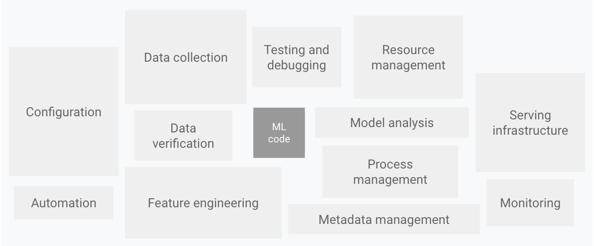
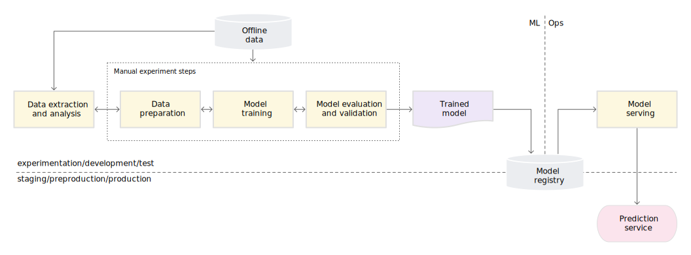
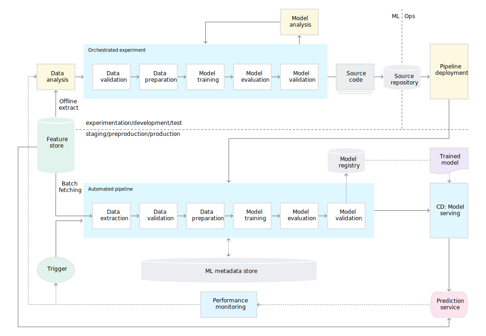
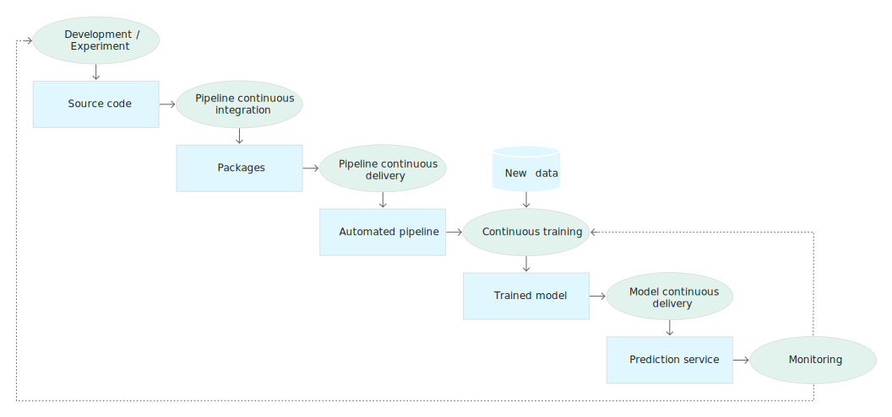

# MLOps
{: .no_toc }

  

    Table of contents
  

  {: .text-delta }
1. TOC
{:toc}

---

## モデルのデプロイ

Jupyter notebook でモデルの学習を行っただけでは、そのモデルはメモリ上にあるだけなのでnotebook を閉じると失われてしまう。  
機械学習モデルを実戦投入するためには、どこかに学習済みのモデルを出力して、それを用いて推論実行できる形にデプロイしなければならない。  
モデルを出力する形式としてよく用いられるものは以下の通り。  

- pickle形式
  - python一般
- HDF5形式
  - Keras
- SavedModel形式
  - TensorFlow
- ONNX形式
  - 機械学習フレームワークに捉われない共通形式

何より、どんなに高性能のモデルが出来上がっても、実戦投入されなければ意味がない。  
デプロイのやり方には大きく分けて2つの方法があると言われている。  

1. サーバ構築パターン  
  - 推論実行用のサーバを構築する  
  - 学習済みのモデルをサーバ上に配置しておく  
  - ユーザはAPIなどで推論させたいデータをサーバに投げる  
  - サーバ上に配置したモデルが推論を行う  
  - 推論結果がサーバから戻ってくる  

サーバ構築パターンのメリット  
- 推論実行環境が1つなのでモデル更新などの保守管理が容易  

サーバ構築パターンのデメリット  
  - 推論実行にはサーバに接続できるネットワーク環境が必須  
  

2. モデル配布パターン  
  - 学習したモデルを配布する  
    - exeファイル  
    - VBAツール  
    - コンテナ  
  - ユーザ個々人が自身のPC上で配布されたモデルを動かして推論実行する  

モデル配布パターンのメリット  
  - ネットワークから隔離された環境でも推論実行可能  

モデル配布パターンのデメリット  
- バラバラの環境で実行されるためモデル更新などの保守管理が大変  
  - 新しいモデルが配布されているのに、古いモデルを使い続ける人とか...  

ちなみに、モデル配布パターンでユーザ個々人に配布するのではなく、自動車や家電製品など個々の機械に組み込んでしまえというのがエッジAIの考え方。  
さらに、サーバ構築パターンでは要件に合わせて構成を色々検討する必要がある。  

- バッチ実行かオンライン実行（リアルタイム実行）か
- リクエストに対して同期か非同期か
- 単一webサーバ上でリクエスト処理と推論実行を行うか、それともリクエスト処理用のwebサーバと推論実行用のappサーバに分けるか
- リクエストされる推論用データは前処理済みのものか、それともサーバ側でデータ前処理からやる必要があるのか
- データ前処理からサーバ側でやる必要があるなら、推論実行用のappサーバとは別にデータ前処理用のappサーバを立てるか
- データ前処理と推論実行を繋ぐパイプラインをどう整備して、どうオーケストレーションするか
- 可用性はどう確保するか
- 冗長構成をとるか
- 同じデータを何度も推論することがあるなら、キャッシュを使ってレスポンス速度を上げた方が良いのでは

機械学習モデルを用いたシステム（機械学習システム）というと、どうしてもモデル作成や推論精度が注目されがち。  
しかし、実際に機械学習システムの中で機械学習モデルが占めている割合はほんの一部。

出典：https://cloud.google.com/architecture/mlops-continuous-delivery-and-automation-pipelines-in-machine-learning

これらを踏まえると、機械学習モデルのデプロイとは、「機械学習モデルという名のソフトウェアをサーバ上で動かすお仕事」と読み替えられる。  
&rarr; ソフトウェアエンジニアとかサーバサイドエンジニアとか呼ばれている方々の領域

## MLOpsとは

機械学習モデルを実戦投入するためには、単に機械学習モデルを作るだけでなく、ソフトウェアエンジニアリングやサーバサイドエンジニアリングと呼ばれる分野の知識・技術が必要。  
そこで登場したのがMLOpsという考え方。  
MLOpsとはDevOpsとMachine Learning を融合させたもの。  
つまり、機械学習システムの開発と運用をいかにして実践投入するか？という課題に対して、DevOpsの手法を持ち込んで解決を図ろうとする考え方。  
ここ数年で非常に活発化している分野。  
[Googleの記事](https://cloud.google.com/architecture/mlops-continuous-delivery-and-automation-pipelines-in-machine-learning)が定番の説明。

## 機械学習システムの構成

Googleの記事では、MLOpsの実現度合いに応じて機械学習システムを3つのレベルに分類している。

- レベル0: 手動プロセス
- レベル1: MLパイプラインの自動化
- レベル2: CI/CDパイプラインの自動化

### レベル0: 手動プロセス

レベル0は機械学習実践における最初の一歩。  
モデルの作成やモデルのデプロイが手動で行われるのが特徴。  
誰しも必ず通る道だが、このまま実戦投入するとだいたい失敗するらしい。  
一般的な流れは以下の図の通り。  

出典：https://cloud.google.com/architecture/mlops-continuous-delivery-and-automation-pipelines-in-machine-learning

  
- 蓄積データから都度、手動でモデルをトレーニングする
- トレーニング済みモデルを出力して保存しておく (Model Repositry)
- 出力済みのモデルをサーバ上で動かせるようにする
- モデルを本番環境サーバにデプロイする

**レベル0の特徴**
- 基本的に全ての作業は手動で行う想定
  - 部分的にスクリプト化して自動化するのもこのレベルに含まれる
- リリース後に実装を変更することは想定していない
  - CIなし
- モデルのバージョンアップもほとんど想定していない
  - CDなし
- 本番環境へリリースしたモデルのパフォーマンス監視もほとんど行わない想定

**レベル0の課題**
- 環境変化のスピードにモデルが適応できず、パフォーマンスがどんどん低下する
- 全ての作業が手動なので、何をするにも工数がかかる

### レベル1: MLパイプラインの自動化

レベル1はレベル0の課題を克服した段階。  
克服するために最低限、次の対応を行っている。  

- 本番環境でのモデルパフォーマンスの積極的な監視
  - パフォーマンス低下を検知して、再トレーニングのトリガーとする
- 本番環境にリリースしたモデルを頻繁に再トレーニング
  - 頻繁に再トレーニングすることで、本番環境のモデルを環境変化に適応させる
- 新しい実装を継続的にテスト
  - よりパフォーマンスを向上させるために、新しい技術やアイデアを取り入れた新しい実装を次々試行する

単に出来上がったモデルを本番環境にデプロイするのではなく、「モデルをトレーニングして、出来上がったモデルが基準を満たしていた場合に自動デプロイする」というパイプライン丸ごとを本番環境にデプロイするのが特徴。  
一般的な流れは以下の通り。

出典：https://cloud.google.com/architecture/mlops-continuous-delivery-and-automation-pipelines-in-machine-learning

  
- Feature Store に集計済みの特徴量を蓄積しておく
- Feature Store の特徴量を使用して新しいモデルを実装し、モデルを評価する
  - このとき、モデルトレーニング〜モデル評価の流れはパイプライン化しておく
- テストクリアしたパイプラインのソースコードを他環境でも再現可能にして保存する (Source Repository)
- ソースコードからパイプラインのコンポーネントをビルドする
- ビルドしたパイプラインを丸ごと本番環境にデプロイする
- デプロイされたパイプラインでモデルをトレーニングする
  - トレーニングに使用するデータはFeature Store から持ってくる
    - テスト時の特徴量と同じロジックで集計された最新の特徴量を即座に使用可能
  - トレーニングに使用したパイプラインの情報はメタデータとして管理する (Meta Data Store)
- トレーニングされたモデルを自動デプロイして推論に使用する
- 推論結果のパフォーマンスを監視する
- パフォーマンス低下を検知したら、それをトリガーとしてパイプラインを実行
  - 最新のデータでモデルが再トレーニングされる

**レベル1の特徴**
- テストの迅速化
  - モデルトレーニング〜モデル評価をパイプライン化することで迅速化
- トレーニング済みのモデルをデプロイするのではなく、トレーニングするためのパイプライン丸ごとをデプロイ
  - そのためには、環境が変わっても再現性のあるコンポーネントを実装
  - 新しいパイプラインのデプロイは頻繁には行わない想定
    - パイプラインのデプロイ作業自体は手動
- 本番環境にリリースしたモデルを再トレーニングして環境変化に適応 (Continuous Training; CT)
- Data Validation
  - 異常値が多発していないかなど入力される特徴量をチェック
    - 特徴量の分布が変わっただけなら再トレーニングで適応可能
    - そもそもその特徴量に意味がなくなりました、みたいな事態になってくると再トレーニングだけではなく、データ収集方法の見直しや新しい特徴量生成なども視野に入れた対応が必要
- Model Validation
  - 再トレーニングしたモデルの評価
  - 本番環境で稼働中のモデルとの比較
  - 基準を満たしたモデルを自動デプロイ
- Feature Store
  - 特徴量の一元管理
    - 特徴量集計ロジックの統一
      - 開発/テスト時の特徴量集計ロジックと、本番稼働している特徴量の集計ロジックが実は違ってました、みたいな事故回避
    - 最新の特徴量を即座に利用可能
      - 使う度に都度都度集計する必要がなくなる
- Meta Data Store
  - パイプラインの実行情報を保存する
    - パイプラインやコンポーネントのバージョン
    - パイプライン実行日時、処理時間
    - パイプラインの実行環境
    - パイプラインに渡した引数
    - モデルアーティファクト

**レベル1の課題**
- 新しいパイプラインのデプロイは頻繁には行わない想定
  - パイプラインのデプロイ作業自体は手動
- したがって、新しいアイデアや技術を迅速に本番投入することができない

### レベル2: CI/CDパイプラインの自動化

レベル2はレベル1の課題を克服した段階。  
克服するために次のことを実現している。

- 「モデルをトレーニングして、出来上がったモデルが基準を満たしていた場合に自動デプロイする」というパイプライン自体のCI/CDシステム

一般的な流れは以下の図の通り。

出典：https://cloud.google.com/architecture/mlops-continuous-delivery-and-automation-pipelines-in-machine-learning

- Feature Store に蓄積してある特徴量を使用して、モデルのトレーニング〜モデル評価を行うパイプラインを作り、ソースコードに再現性を持たせるところまではレベル1と同じ
- レベル1ではソースコードからパイプラインをビルドしてデプロイするのは手動で行なっていた
- レベル2ではここにCI/CDが入る
- ソースコードがリポジトリにプッシュされるとCIプロセスが走る
  - ソースコードをビルド
  - テスト実施
  - パイプラインのコンポーネントを出力
- CIプロセスがクリアされるとCDプロセスが走る
  - CIプロセスで出力されたコンポーネントから、本番環境にパイプラインをデプロイする
- 以降の流れはレベル1と同じ

「モデルをトレーニングして、出来上がったモデルが基準を満たしていた場合に自動デプロイする」というパイプライン自体のCI/CDシステムの流れだけを抜き出して書くと以下の通り。  

出典：https://cloud.google.com/architecture/mlops-continuous-delivery-and-automation-pipelines-in-machine-learning

**レベル2の特徴**
- 新しいパイプラインを即座に本番投入可能
- 基本的に全工程を自動化しているので安全かつ作業工数も抑えられる

## モデルの運用監視

レベル1, 2の機械学習システムではモデルパフォーマンスの監視が必須。  
ここで監視している指標は大きく分けると次の2種類。

- モデルの精度に関する指標
  - アウトプットの監視
- 特徴量の分布に関する指標
  - インプットの監視

なお、エラー検知やレイテンシなど一般的なシステム監視も当然必要だが、ここでは機械学習モデルの監視に限定する。  

### モデルのアウトプットの監視

監視対象としてイメージしやすいのは、モデルの精度に関する指標。  
推論結果がどのくらい正解しているかを、モデル評価のときと同じ精度指標を用いて監視していく。  

**アウトプット監視の課題**
- 精度が落ちたことが検知されてからモデルの再トレーニングが走る  
- しかし、精度が落ちたことを検知できるようになるまでにはラグが存在する
  - 例えば、ECサイトの会員が向こう1週間で商品を購入する確率を推論したとする
  - 推論結果が正解だったかどうかわかるのは1週間後
  - 半年後の退職予測モデルだったら、正解がわかるのは半年後
- 精度の低下が顕著になってから対応したのでは遅い
- 精度の低下が顕著になる前に手を打ちたい

### モデルへのインプットの監視

トレーニングおよびモデル評価時の検証では十分に精度の良い機械学習モデルでも、運用をしていくと時間の経過とともに推論精度が低下していく。  
この要因を分解すると次のいずれか。

- 推論用の特徴量の分布が、トレーニングおよび検証時の特徴量の分布から変化している  
  &rarr; データドリフト
- 推論用の特徴量とターゲットの関係が、トレーニングおよび検証時の特徴量とターゲットの関係から変化している  
  &rarr; コンセプトドリフト

Gama et al (2014) ではデータドリフトもコンセプトドリフトの1種類とみなして体系化されているが、一般にはデータドリフトはデータドリフトとして別扱いされている様子。  

### データドリフト

データドリフトとは、特徴量の分布がトレーニングと推論時とで変化してしまうこと。  
時間の経過とともにモデル精度が低下する原因になる。  
&rarr; 裏を返せば、データドリフトを検知できればモデル精度の低下を予測できる  
&rarr; データドリフトを検知した時点で再トレーニングすれば、精度の低下が顕著になる前に対応できる  

データドリフトを検知するためによく使われる指標には次のようなものがある。  
どの指標も計算の前準備として、監視したい特徴量$x$をトレーニング時・推論時で同じ幅にビニングして各ビンの相対度数を求める。  
トレーニング時の相対度数を$p(x)$として、推論時の相対度数を$q(x)$と表記する。

- Kullback-Leibler Divergence  
  - 2つの確率分布がどのくらい異なっているかを表す  
  - $0$から$\infin$をとる  
  - 小さければ小さいほど2つの確率分布が似ていて、$0$だと一致する  
\\[
\begin{align}
D_{KL}(p||q) &= CrossEntropy - Entropy \cr
&= - \sum_{x} p(x) \log q(x) - \left( - \sum_{x} p(x) \log p(x) \right) \cr
&= \sum_{x}p(x) \log \frac{p(x)}{q(x)}
\end{align}
\\]

- Jensen-Shannon Divergence  
  - Kullback-Leibler Divergence は\[D_{KL}(p||q) \neq D_{KL}(q||p)\]なので距離の公理を満たさない  
  - 距離の公理を満たすようにしたのがJensen-Shannon Divergence  
  - Kullback-Leibler Divergence 同様2つの確率分布がどのくらい異なっているかを表す  
  - $0$から$\infin$をとる  
  - 小さければ小さいほど2つの確率分布が似ていて、$0$だと一致する  
\\[
\begin{align}
D_{JS}(p||q) = \frac{1}{2} D_{KL}(p||M) + \frac{1}{2} D_{KL}(q||M) \cr
where \ M = \frac{1}{2}(p(x)+q(x))
\end{align}
\\]

- PSI (Population Stability Index)  
  - 時間の経過に伴って、その変数の分布がどのくらい変化したかを表す  
  - 金融業界のデファクトスタンダードらしい  
  - 次のように解釈する
    - 0.1未満 &rarr; ほとんど変化なし
    - 0.1以上0.2未満 &rarr; 変化あり
    - 0.2以上 &rarr; 大きな変化あり
  - 0.2ではなく0.25を閾値として使用することもある  
\\[
PSI = \sum_{x} \left\{ (p(x)-q(x)) \cdot \log \frac{p(x)}{q(x)} \right\}
\\]

### コンセプトドリフト

コンセプトドリフトとは、特徴量とターゲットの関係性がトレーニング時と推論時とで変化してしまうこと。  
データドリフト同様、モデル精度低下の原因になる。  
しかし、データドリフトと異なり早期に検知することが困難。  

**コンセプトドリフトの例①**
- お弁当屋さんがメニュー別に翌週の需要を予測して材料の発注を掛けている
- 需要予測の特徴量には季節や天気予報、過去の販売実績などを使用して、結構あたっていた
- コロナ禍になって、需要予測が下振れするようになった  
  &rarr; コロナ禍のテイクアウト需要増という人々の意識変化がターゲットに大きく影響  
  &rarr; 今までの特徴量だけではターゲットを説明できなくなってしまった

**コンセプトドリフトの例②**
- ニュースサイト運営者がレコメンデーションシステムを用いて、ユーザーごとにお勧めの記事を配信している
- レコメンデーションシステムの特徴量には、各ユーザーが過去に閲覧した記事のジャンルを用いている
- あるユーザーはこれまでに結婚式関連の記事をたくさん読んでいた
- レコメンデーションシステムはそのユーザーに結婚式関連の記事をお勧め配信した
- お勧め配信した結婚式関連の記事はほとんど閲覧されていた
- ある日を境に、そのユーザーに結婚式関連の記事をお勧めしても全く閲覧されなくなってしまった  
  &rarr; そのユーザーはもう結婚式を挙げたので、興味が別のところへ移った
