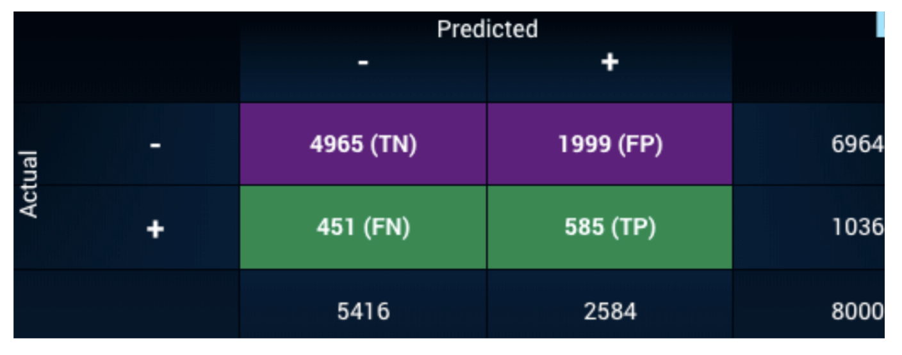

# モデル評価
{: .no_toc }

  

    Table of contents
  

  {: .text-delta }
1. TOC
{:toc}

---

## 評価指標

出来上がったモデルの精度を判断するための指標。

### 回帰問題の評価指標

回帰問題では単純に以下のように言える。  
- 実測値と予測値の差が...  
  - 小さい &rarr; 良いモデル  
  - 大きい &rarr; 悪いモデル  

したがって、MSEをベースにモデルを評価可能。  
MSEを含む代表的な指標は以下の通り。  
ただし、実測値を$y_i$として、モデルの出力を$\hat{y_i}$とする。

#### MSE (Mean Squared Error)

$$
\begin{align}
MSE = \frac{1}{n} \sum_{i=1}^{n} (y_i-\hat{y_i})^2
\end{align}
$$

- 一番基本的な指標
- ルートを付けてRMSEにすることもあるが意味は全く同じ
- $0$から$\infty$をとる
- 小さいほど良い  
- 計算上は優れているが、ビジネスサイドに説明するのには向いていない
  - 土地の価格を予測しました。誤差は平均して300円の2乗です。

#### MAE (Mean Absolute Error)

$$
\begin{align}
MAE = \frac{1}{n} \sum_{i=1}^{n} |y_i-\hat{y_i}|
\end{align}
$$

- 2乗ではなく絶対値で出るのでMSEより解釈しやすい
  - 土地の価格を予測しました。誤差は平均してプラスマイナス300円です。
- $0$から$\infty$をとる
- 小さいほど良い
- 実測値とモデルの出力の差が大きくなると、MAEよりもMSEの方が顕著に悪化する  
  cf. $y=x^2$のグラフと$y=|x|$のグラフ

#### MAPE (Mean Absolute Percentage Error)

$$
\begin{align}
MAPE = \frac{1}{n} \sum_{i=1}^{n} \left| \frac{y_i-\hat{y_i}}{y_i} \right|
\end{align}
$$

- 実測値に対して何%ズレたかを表せる
  - 土地の価格を予測しました。誤差は平均して10%です。
- 解釈しやすいので人気
- $0$から$\infty$をとる
- 小さいほど良い
- 使用上は注意が必要
  - 実測値が$0$になる場合は計算できない
  - 外れ値があると簡単に爆発する
    - 日次CV数予測で日々のCV数は100前後で推移している
    - 1日だけCV数が3の日が存在する
    - モデルの出力は100だったとするとMAPEは$|\frac{3-100}{3}|=3,233\%$

#### WMAPE (Weighted Mean Absolute Percentage Error)

$$
\begin{align}
WMAPE = \frac{ \sum_{i=1}^{n} \left| y_i-\hat{y_i} \right| }{\sum_{i=1}^{n} \left| y_i \right|}
\end{align}
$$

- MAPEで実測値に$0$があると計算できない問題に対応
- 平均実測値に対して平均予測値が何%ズレたかを表せる
- ちょっとトリッキーだが説明はしやすい
  - 土地の価格を予測しました。誤差は平均して10%です。
- $0$から$\infty$をとる
- 小さいほど良い

### 分類問題の評価指標

分類問題も単純に考えると以下のように言えそうだが...  
- 誤分類したサンプルの数が...  
  - 少ない &rarr; 良いモデル  
  - 多い &rarr; 悪いモデル  

果たして0を1と誤分類するのと、1を0と誤分類するのを同程度に評価して良いのか、という疑問が生じる。  
  - 例えば医療現場で腫瘍を診断すると仮定  
  - 次の2つの誤分類は同程度で良いのか？  
    1. 良性腫瘍と診断したら、実は悪性腫瘍だった  
    2. 悪性腫瘍と診断したら、実は良性腫瘍だった  
    &rarr; どう考えても1つ目の誤分類の方が危険  
    &rarr; 1つ目の誤分類を避けられるなら、2つ目の誤分類は許容しても良い  

したがって、誤分類は誤分類でも絶対あかん誤分類か、それともまだ許容できる誤分類か、どっちをやらかしたのか考慮できるような評価指標が欲しい。

#### 混同行列

分類問題の評価指標を考えるときに避けて通れないのが混同行列。  

出典：https://www.datarobot.com/jp/wiki/confusion-matrix/

- TP (True Positive)
  - モデルの出力はPositive
  - 実際はPositive
  &rarr; 結果はTrue
- TN (True Negatige)
  - モデルの出力はNegative
  - 実際はNegative
  &rarr; 結果はTrue
- FP (False Positive)
  - モデルの出力はPositive
  - 実際はNegative
  &rarr; 結果はFalse
- FN (False Negative)
  - モデルの出力はNegative
  - 実際はPositive
  &rarr; 結果はFalse

これら4つの組み合わせで指標を考える。  
よく登場する指標は以下の通り。  
なお、ここでは以下のようにラベルを振っているとする。  
- 悪性腫瘍 &rarr; Positive &rarr; 1
- 良性腫瘍 &rarr; Negative &rarr; 0

#### Accuracy

$$
Accuracy = \frac{TP+TN}{TP+TN+FP+FN}
$$

- 単純にどのくらい正解したか
- $0$から$1$をとる
- 大きいほど良い
- これだと色々不都合があるから他の指標が考え出された
  - 腫瘍といっても大多数は良性で、悪性なのは極少数
    - とりあえず良性と診断しておけば、例え悪性だったとしてもAccuracyは良くなる

#### Precision

$$
Precision = \frac{TP}{TP+FP}
$$

- Positiveと判断したうち、いくつが本当にPositiveだったか
- $0$から$1$をとる
- 悪性腫瘍と診断された患者が実際には何人悪性だったか
- 注意点
  - 自信を持って悪性腫瘍だと断言できる患者だけを悪性腫瘍と診断
    &rarr; Precisionは良いが、取りこぼしが生まれる

#### Recall

$$
Recall = \frac{TP}{TP+FN}
$$

- 実際にはPositiveなものを、いくつ正解できたか
- $0$から$1$をとる
- 大きいほど良い
- 本当に悪性腫瘍の人を何人悪性と診断できたか
- 注意点
  - ちょっとでも疑わしい患者は片っ端から悪性腫瘍と診断
    &rarr; Recallは良いが、診断結果の信憑性が損なわれる

#### F1-Score

PrecisionとRecallはトレードオフなので、両者のバランスを取った指標が欲しい。

$$
\begin{align}
F1 &= \frac{2}{Recall^{-1}+Precision^{-1}} \cr
&= \frac{2 \cdot Recall \cdot Presicion}{Recall+Precision} \cr
&= \frac{2 \cdot TP}{2 \cdot TP + FP + FN}
\end{align}
$$

- PrecisionとRecallの調和平均
- $0$から$1$をとる
- 大きいほど良い
- 注意点
  - 悪性腫瘍と良性腫瘍の割合（正例割合）が不均衡で、悪性腫瘍の数が極端に少なかった場合、次のようにラベルを逆につけているとF1-Scoreが意味をなさない
    - 悪性腫瘍 &rarr; Negative &rarr; 0
    - 良性腫瘍 &rarr; Positive &rarr; 1
    &rarr; 全患者良性と診断しておけば、PrecisionもRecallもF1-Scoreも全て良くなる
    &rarr; 少数の事象をPositiveにしておくのがポイント

#### マシューズ相関係数 (Matthews Correlation Coefficient; MCC)

F1-Scoreのように多数の事象と少数の事象、どちらがPositiveでもきちんと判断できる指標が欲しい。

$$
MCC = \frac{TP \cdot TN - FP \cdot FN}{\sqrt {(TP+FP)(TP+FN)(TN+FP)(TN+FN)} }
$$

- 多数の事象と少数の事象、どちらがPositiveでも使える
- やっていることは実測値とモデルの出力について、ピアソンの積率相関係数を計算している
- $-1$から$1$をとる
- モデルの出力が実測値と完全一致だと$1$
- モデルの出力が実測値と完全不一致だと$-1$
- $0$だと完全なランダム予測と同義
- 注意点
  - 式がめちゃくちゃ見づらいので説明しにくい
  - 混同行列の見た目から直感的に想像する値よりも小さい  

参考：https://qiita.com/mmmmm1202/items/a4628bc549288f4dee33

#### ROC-AUC

ROC曲線 (Receiver Operating Characeristics Cureve) の下の面積 (Area Under Cureve) のこと。  

出典：https://scikit-learn.org/stable/modules/model_evaluation.html#roc-metrics

- True Positive Rate  
  - Recallのこと
  - 実際にはPositiveのものを、いくつPositiveとモデルが出力したか
$$
TPR = \frac{TP}{TP+FN}
$$

- False Positive Rate  
  - 実際にはNegativeのものを、いくつPositiveとモデルが出力したか
$$
FPR = \frac{FP}{FP+TN}
$$

- モデルの出力そのものは確率
- その確率に閾値を設けてPositive/Negative変換している
&rarr; 閾値を変えればPositive/Negativeの変換結果も変化する  
&rarr; TPRとFPRの値も変化する  
&rarr; 閾値を変化させながらTPRとFPRをプロットしていったのがROC曲線  

- AUCはROC曲線の下の面積
- $0.5$から$1$をとる
- 大きいほど良い
- 注意点
  - 正例割合が不均衡だとAUCは大きくなる
  &rarr; 実際には大したことないモデルでも良さそうに見えてしまう

## 学習曲線

機械学習の文脈で言う学習曲線とは、横軸にサンプルサイズ、縦軸に各サンプルサイズでの損失関数の値をプロットしたグラフ。  
トレーニングデータのグラフと検証用データのグラフを重ねて描く。  
  &rarr; 学習が順調に行えているか判断する材料になる

出典：https://scikit-learn.org/stable/auto_examples/model_selection/plot_learning_curve.html

  
以下のような状態が望ましい。  
- トレーニングスコアも検証スコアも良いスコア
- トレーニングスコアと検証スコアのギャップが小さい
- 両スコアのギャップが小さくなってからはずっと一定で推移している
  - 再びギャップが大きくなることはない  
  
上の図で言うと、SVMの学習曲線が望ましい状態になっている。  
  - トレーニングスコアも検証スコアも100%付近  
  - 両スコアのギャップも小さくなる一方で広がっていない  
  &rarr; 良いモデルが作れている  

ナイーブベイズの学習曲線は次のように判断できる。  
  - 両スコアのギャップは小さくなる一方で広がってはいない  
  - トレーニングスコアも検証スコアも85%付近  
  &rarr; 目指すスコアが最初から85%なのであればこれでも良いモデル  
  &rarr; 90%台を目指していたのだとすると、いまいちなモデル

ナイーブベイスのモデルを改善しようとしたとき、学習曲線から次にとるべきアクションが分かる。  
- そもそもトレーニングスコアと検証スコアのギャップが大きい  
  &rarr; バリアンスが大きい  
  &rarr; オーバーフィット（過学習）  
  &rarr; 対策  
    - サンプルを増やす  
    - 特徴量の数を減らす  
    - 正則化を強くする  

- トレーニングスコアと検証スコアのギャップは小さいが精度が出ていない
  &rarr; バイアスが大きい  
  &rarr; アンダーフィット  
  &rarr; 対策  
    - 特徴量を増やす  
    - 正則化を弱くする  

巷で「データを増やせば増やすだけ機械学習モデルの精度は向上する」などと言われているが、アンダーフィットしている状態ではいくらデータを増やしても精度は向上しない。

## バイアスとバリアンス  

実測値と予測値の差を誤差と定義すると、誤差を次の2つの要素に分解できる。  

- バイアス (Bias)  
  - 母平均（真の平均）から標本平均（サンプルの平均）がどのくらいズレているか
  - 偏りとも表現される
- バリアンス (Variance)  
  - 各標本値が標本平均を中心にどのくらいバラついているか
  - 分散とも表現される  

  

したがって、単純に「誤差」と言っても次の4パターンが存在する。  

  

誤差を小さくしようと思ったら、まず自分がどのパターンに直面しているのかを把握する必要がある。  
  &rarr; 学習曲線を描くことで把握できる  
把握できたら、パターンごとに適した対応を実行する。
