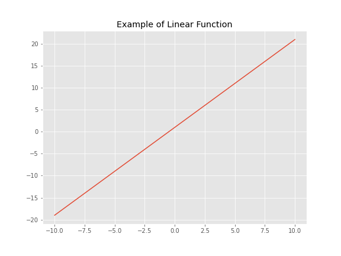
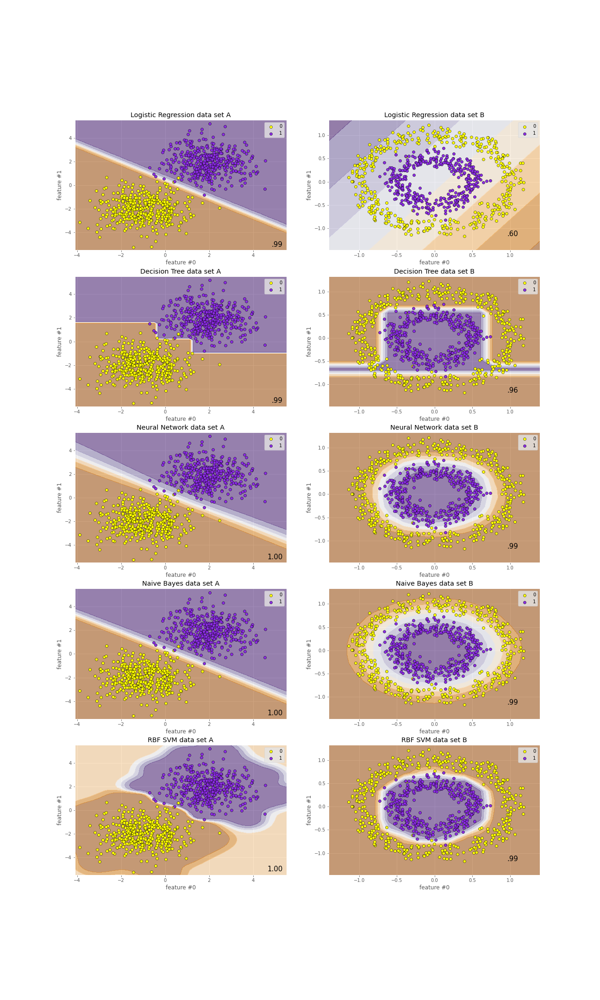

# 非線形問題
{: .no_toc }

  

    Table of contents
  

  {: .text-delta }
1. TOC
{:toc}

---

## 線形とは

今までさり気なく使っていた「線形」という言葉の意味を定義する。  
なお、「線型」と書かれることもあるが意味は同じで、どちらもlinearの訳語。  
どちらの漢字を使うかはその人の趣味や思想による。  

- 線形とは線形性のこと  

線形性の定義は以下の通り。  
- $\alpha$を任意の定数として関数$y=f(x)$が以下を満たすとき、関数$y=f(x)$は線形性を持つ  
    - $f(x_1+x_2) = f(x_1)+f(x_2)$  
    - $f(\alpha x) = \alpha f(x)$  

&rarr; 足し算、引き算、定数倍だけで定義できるかどうか。  

例えばこんな関数。  
$y=2x+1$  
&rarr; 足し算と定数倍で定義されている
  

足し算、引き算、定数倍だけでは定義できないものは非線形。  
例えばこんな関数。  
$y=2x^2+1$  
&rarr; 変数同士の掛け算を使って定義されている  
  

- 注意
    - 以下のようなモデルも線形モデルと呼ばれる
        - $y=\beta_0 + \beta_1x_1 + \beta_2x_2 + \beta_3x_1x_2$
        - $y=\beta_0 + \beta_1x_1 + \beta_2x_1^2$
    - 確かに変数$x$視点で見れば掛け算が入っているので非線形
    - 一方、パラメータ$\beta$視点で見れば足し算と定数倍だけなので線形  
        &rarr; なので線形モデル

## 非線形問題

例えばこんな3列構成のデータセットが2つあったとする。  
- １列目：feature #0
- ２列目：feature #1
- ３列目：target (0 or 1)
- サンプルサイズ：2,000

  

- データセットA  
    - 直線を1本引けば0と1を分離できそう  
        &rarr; 線形分離可能
- データセットB
    - どんな直線を引いても1本では0と1を分離できなさそう  
        &rarr; 線形分離不可能  
        &rarr; 非線形問題

分類結果は以下の通り。  
ただし、2,000サンプルを6:4で分割し、前者で学習、後者でテストを行っている。  
各プロット右下の数字はテスト結果のAccuracyを記載している。  
  

## 非線形問題への対応

データセットBを分類しようと思ったときに、よくある対応方法は以下の通り。  
- 非線形関数で当てはめる  
    - データセットBに対して$ax^2+by^2=0$というモデルの形を仮定する
- 非線形関数を噛ませて線形関数を合成する
    - 2つの線形関数を合成する
        - $f(x)=ax+b$
        - $g(x)=cx+d$  
            &rarr; $f(g(x)) = f(cx+d) = acx+ad+b$  
            &rarr; これだけだと合成後も線形関数  
    - 線形関数の出力に非線形関数を噛ませてから合成する
        - $f(x)=ax+b$
        - $g(x)=cx+d$
        - $S(x)=\frac{1}{1+e^{-x}}$  
            &rarr; $Z=S(f(x))=\frac{1}{1+e^{-(ax+b)}}$  
            &rarr; $g(Z)=cZ+d=\frac{c}{1+e^{-(ax+b)}}+d$  
            &rarr; 一気に複雑な非線形関数ができた  
    - これを延々繰り返すのがニューラルネットワーク
- そもそも関数近似しない  
    - 決定木  
        &rarr; 条件分岐
- 確率分布を考える
    - ナイーブベイズ  
- 距離が近いもの同士でまとめる
    - k-近傍法
- カーネルトリック
    - サポートベクターマシン  