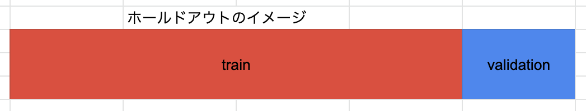
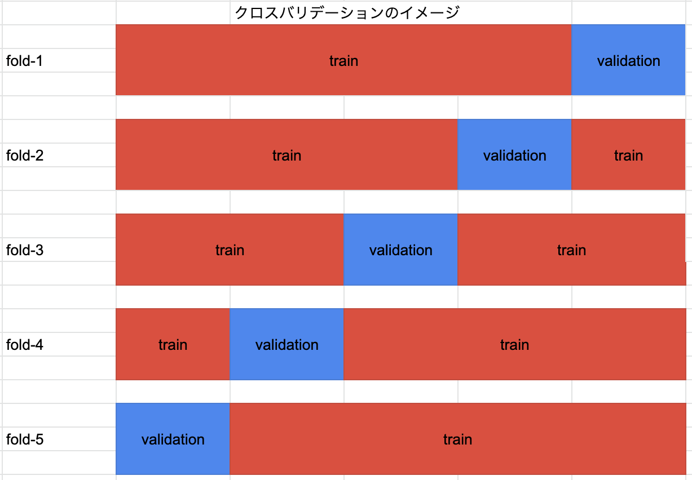
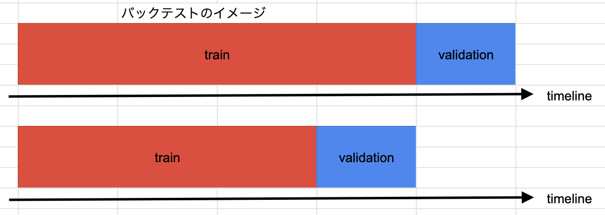
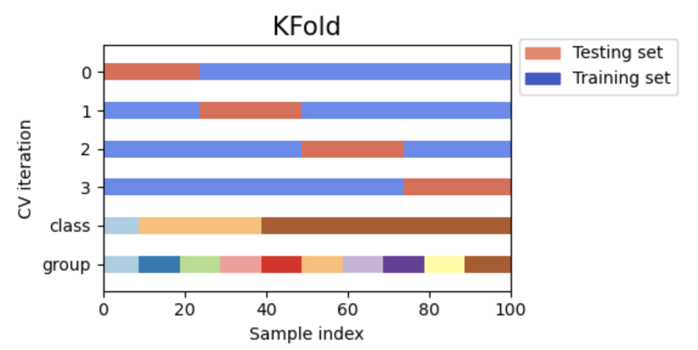
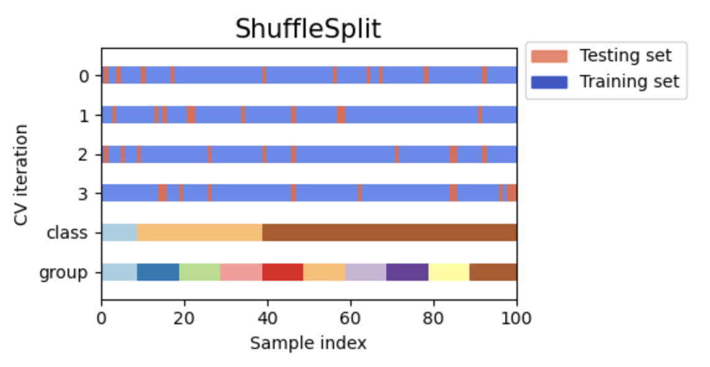
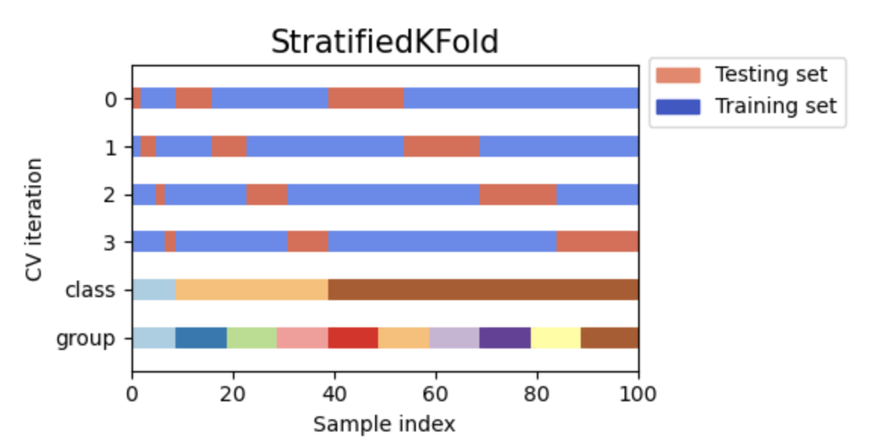
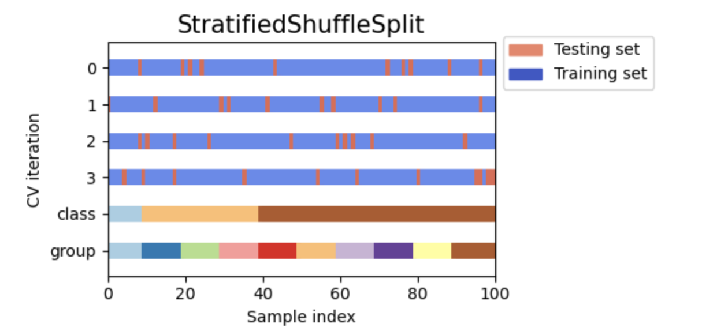
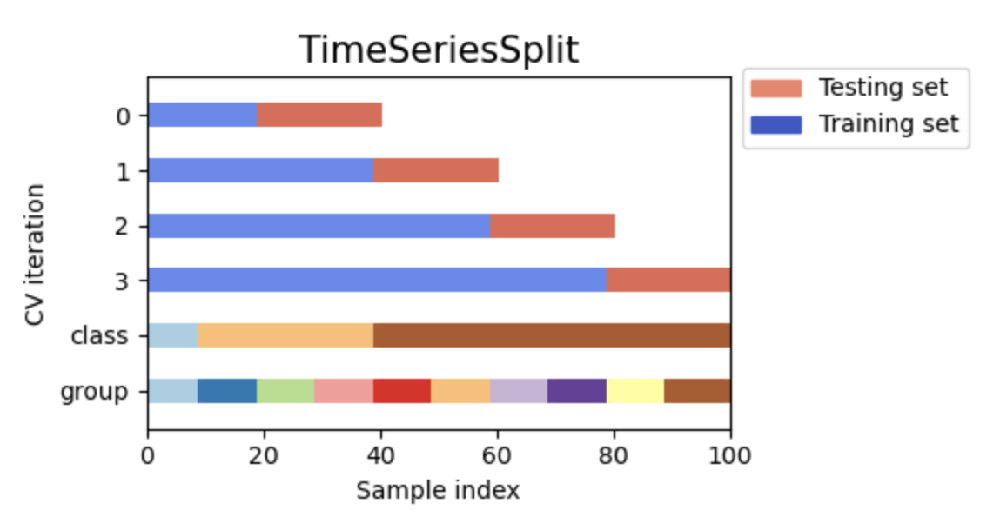
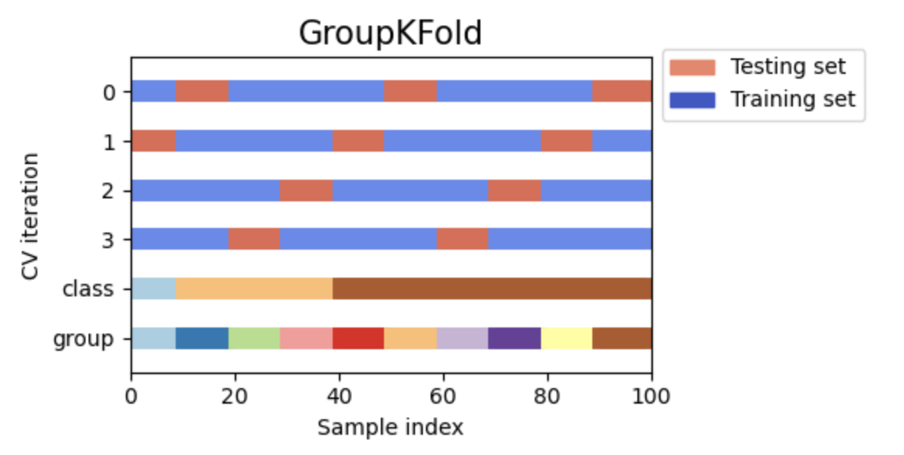

# バリデーションスキーム
{: .no_toc }

  

    Table of contents
  

  {: .text-delta }
1. TOC
{:toc}

---

機械学習モデルを作って、その性能を評価するときに避けて通れないのがばリデーションスキーム。  
例えば学校の勉強で...
- 問題集を解く
- 答え合わせをする
- 間違えたところをもう一度解く
- 答え合わせをする
- これを繰り返す

このとき、どの程度身についたかを測るために同じ問題集を解かせるか？  
&rarr; No!  
なぜなら、同じ問題集を解いても答えを知っているのでみんな高得点がとれてしまう。  
そこで、普通は新たに用意した別の問題を解かせて、その点数で測る。  
  
機械学習モデルにも同じことが言える。  
しかし、現実には必ずしも新しい別の問題（サンプル）がすぐ手に入るとは限らない。  
そこで、今手元にある問題（サンプル）を学習用と性能評価用に分割する。  
学習用サンプルでモデルを作り、性能評価用サンプルでその性能を測ることにする。  
では、学習用と性能評価用をどう分割すると正確に性能を測れるだろうか？  
&rarr; いろいろな分割の枠組み、分割方法が考案されている。  

分割の枠組みをバリデーションスキームと呼ぶ。  
よく用いられるバリデーションスキームは以下の3つ。

## ホールドアウト

ホールドアウトとは、データの一部分だけをとっておくこと。  
Leave One Out (LOO) と呼ぶこともある。  

## クロスバリデーション

クロスバリデーションとは、場所を変えて複数回Leave One Out すること。  
よくCVと略される。  
クロスバリデーション中の個々のLeave One Out をfold と呼ぶ。  

## バックテスト

バックテストとは、時間軸のあるデータにおいて古い部分をtrainに、新しい部分をvalidationに割り当てること。  
時系列に沿った推移を分析するときに用いる。  

## データの分け方

バリデーションスキームを決めたら、具体的にどう分割するかを決める。  
これをパーティショニングと呼ぶこともある。  
バリデーションスキームやデータの中身によって、採用すべきパーティショニングが異なってくるので注意が必要。  
よく用いられるパーティショニングは以下の4つ。

### K-fold

とりあえずサンプルを順番にtrainとvalidationに割り振る。  
- 時系列データには使えない
- 回帰問題でも分類問題でもOK

  

実務上は順番に割り振るのではなく、ランダムに割り振る。  

### Stratified K-fold

層化抽出のこと。  
- 時系列データには使えない
- 回帰問題には使えない
- 分類問題のみOK

これも実務上は順番に層化抽出するのではなく、ランダムに層化抽出する。  

### タイムシリーズパーティション

時系列データのときに用いる。

### グループパーティション

実はサンプルの背後にグループが存在するような時に用いる。  
例えば...
- 社員の退職予測を行いたい
- 2020/1~2021/12の過去2年分のデータを用いる
- 毎月取っている属性や勤怠、人事考課のデータを用いて、その翌半年以内に退職したら1、しなかったら0とラベルを振る  
  &rarr; 1レコード1社員だが、2年間在籍している社員は24レコード登場する  
- Aさんは2年間在籍していたので24レコード存在している
- 2021/12に退職したとすると、2020/1~2021/5の17レコードのラベルは0、2021/6~2021/12の7レコードのラベルは1
- ラベルが1の7レコードのうち、2021/10~2021/12の3レコードだけがtrainに、2021/6~2021/9の4レコードはvalidationに割り振られたら、、、その4レコードについては確実に正解してしまう  
  &rarr; 1ヶ月ではAさんの属性や人事考課はほとんど変わらない  
  &rarr; 明示的に社員番号などIDが入っていなくても、なんとなく同一人物のデータだと分かってしまう  
  &rarr; 本来知り得ないはずの将来退職することがわかった状態で学習してしまう  
  &rarr; リーケージと呼ばれる状態    
  &rarr; 実際以上にモデルの性能が良く見えてしまう  

そうならないように同じグループのものはtrainならtrain、validationならvalidationに固める。

出典：https://scikit-learn.org/stable/auto_examples/model_selection/plot_cv_indices.html

