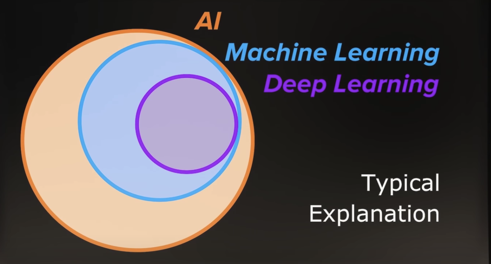

# はじめに

本資料は「機械学習とは何か？」という疑問からスタートし、機械学習に関する周辺知識の中でも実務に直結するものを中心に取り扱う。  
本資料のゴールは、ハンズオンを通して与えられたデータから機械学習モデルを作成・運用に乗せるまでの一連の流れを掴むことである。  

# 機械学習とは何か？

## AIとは

機械学習の話に入る前に、昨今機械学習とニコイチで扱われる人工知能 (Artificial Intelligence; AI) について触れておく。  

- 映画等におけるAIの2種類の描かれ方
    1. 自律して動き回るロボットとして
    1. コンピュータのプログラムとして

|#|名称|出典|備考|
|---|---|---|---|
|1|スカイネット|ターミネーター|自我に目覚めたコンピュータ|
|2|ドラえもん|ドラえもん|猫型ロボット|
|3|C-3PO|スターウォーズ|多言語を理解して二足歩行するドロイド（ロボット）|
|4|レッドクイーン|バイオハザード|研究施設を制御するメインコンピュータ|

ゆえにAIとロボットは混同されがちだが、この2つは明確に異なっている。  
松尾豊『人工知能は人間を超えるか』によれば、ロボットの脳に該当する部分がAIである。  

ただし、AIの定義は専門家の間でも異なっている。  
|専門家|定義|
|---|---|
|中島秀之（公立はこだて未来大学学長）|人工的につくられた、知能を持つ実体。あるいはそれをつくろうとすることによって知能自体を研究する分野である|
|西田豊明（京都大学大学院情報科学研究科教授）|「知能を持つメカ」ないしは「心を持つメカ」である|
|溝口理一郎（北陸先端科学技術大学院大学教授）|人工的に作った知的な振る舞いをするもの（システム）である|
|長尾　真（京都大学名誉教授　前国立国会図書館長）|人間の頭脳活動を極限までシミュレートするシステムである|
|堀　浩一（東京大学大学院工学系研究科教授）|人工的につくる新しい知能の世界である|
|浅田　稔（大阪大学大学院工学研究科教授）|知能の定義が明確でないので、人工知能を明確に定義できない|
|松原　仁（公立はこだて未来大学教授）|究極には人間と区別がつかない人工的な知能のこと|
|武田秀明（国立情報科学研究所教授）|人工的につくられた、知能を持つ実体。あるいはそれをつくろうとすることによって知能自体を研究する分野である（中島氏と同じ）|
|池上高志（東京大学大学院総合文化研究科教授）|自然にわれわれがペットや人に接触するような、情動と冗談に満ちた相互作用を、物理法則に関係なく、あるいは逆らって、人工的につくり出せるシステムを、人工知能と定義する。分析的にわかりたいのではなく、会話したり付き合うことで談話的にわかりたいと思うようなシステム。それが人工知能だ|
|山口高平（慶應義塾大学理工学部教授）|人の知的な振る舞いを模倣・支援・超越するための構成的システム|
|栗原　聡（電気通信大学大学院情報システム学研究科教授）|工学的につくられる知能であるが、その知能のレベルは人を超えているものを想定している|
|山川　宏（ドワンゴ人工知能研究所所長）|計算機知能のうちで、人間が直接・間接に設計する場合を人工知能と呼んでよいのではないかと思う|
|松尾　豊（東京大学大学院工学系研究科准教授）|人工的につくられた人間のような知能、ないしはそれをつくる技術|

出典：松尾豊『人工知能は人間を超えるか』

（

また、計算機知能 (Computational Intelligence; CI) のメジャーな教科書であるPoole et al (1998) では、AIとは計算機知能の研究分野につけられた通称に過ぎず、計算機知能とは周囲の環境にあわせて経験から学習し、目標達成のために行動するシステムであると定義されている。  
このように、AIについての明確な定義は存在していない。  

## 「強いAI」と「弱いAI」

AIに関する議論の1つに「強いAI」と「弱いAI」の議論がある。  
- 1980年にアメリカの哲学者ジョン・サールが提唱した
- Searle (1980) では、心や脳の研究おいて人間の認知能力をコンピュータでシミュレーションするにあたり、2種類のAIを区別するのが良いと述べられている
    1. 弱いAI (Weak AI)：仮説検証に用いることができるツール
    1. 強いAI (Strong AI)：単なる仮説検証のツールに留まらず、心を持ち、物事を理解し、認知能力を持つ適切にプログラムされたコンピュータ

「強いAI」と「弱いAI」の例に用いられるのが、Searle (1980) で述べられている「中国語の部屋」という例え話である。  
- 中国語の読み書きはできないが英語の読み書きはできる人に英語で書かれた規則集を渡しておく
- その上で彼に中国語で書かれた質問文を渡す
- 中国語が読めない彼にとって、質問文はただの記号の羅列に過ぎない
- しかし彼が持っている規則集には「これこれの記号の羅列にはこんな記号の羅列で返すように」と指示が書かれている
- 彼は規則集を調べて該当した指示の通りに記号の羅列を書いて回答する
- 一見すると彼は中国語の文章でやり取りをしているように見えるが、果たして中国語を理解していると言えるだろうか？

この分類は後に支持され、AIのメジャーな教科書であるRussell and Norvig (2003) では以下のように定義されている。

1. 弱いAI (Weak AI)：思考しているかのように振る舞う機械
1. 強いAI (Strong AI)：実際に思考する機械

なお、アメリカの実業家レイ・カーツワイルは著書 "The Singularity is Near (2005)" において、強いAIを「人間と同等の知性を持った機械」として述べているが、これは本来の強いAIの定義とは異なり「汎用型AI」に近い定義である。

## 「汎用型AI」と「特化型AI」

AIの分類に関するもうひとつの議論が「汎用型AI」と「特異型AI」である。  

1. 汎用型AI (Artificial General Interigence; AGI)：人間と同じように認知能力を持ち、言語を理解したり学習したり、知的な活動を行うエージェント（システム）
1. 特化型AI (Narrow AI)：特定の問題解決のために設計されたプログラム

映画などによく登場するのは汎用型AIであるが、2022年現在ではまだ実現していない。  
昨今話題となっているものは全て特化型AIである。  

ちなみに、レイ・カーツワイルはその著書の中で2029年には汎用型AIに相当するものが実現すると予想している。

## 機械学習とは

機械学習のメジャーな教科書であるMitchell (1997) によれば、機械学習とは経験を通してコンピュータに自ら学ばせる技術として定義される。

そして、AIと機械学習の関係については、一般にAIという概念のサブセットが機械学習と言われることが多い。

しかし、AIと機械学習の関係も明確な定義は定まっていない。  
例えばDataRobot 創業者のJeremy Achin は次のように定義している。  

少なくとも言えることは以下２つ。
- AIを実現する手法の1つが機械学習だということ
- 近年では機械学習の成果が他の手法に比べて圧倒的なことから、AIと機械学習がほぼ同義のように扱われているということ

## AIの歴史

機械学習が注目されている理由は、AIの歴史を振り返るとはっきりする。  
なお、AIの歴史は松尾豊『人工知能は人間を超えるか』に分かりやすく述べられている。

### 第1次AIブーム

- 1956~1974
- 切っ掛け
    - ダートマス会議
- 中心技術
    - 探索木
        - 記号主義者によるルールーベース
    - 単純パーセプトロン
        - コネクショニストによるニューラルネットワーク
- ブームの終わり
    - 探索木では迷路やパズルなど特定の問題しか解けない
        &rarr; 現実的な問題は解けない
    - 単純パーセプトロンではXOR関数を表現できない
        &rarr; やはり単純な問題しか解けない
        - 論理演算の復習
            - 例えば、「男性・女性」「若者・高齢者」の2軸でマトリックスを作る
                &rarr; 若い男性、高齢の男性、若い女性、高齢の女性
        - 論理積
            - 女性 AND 若者 &rarr; 「女性かつ若者」= 若い女性
        - 論理和
            - 女性 OR 若者 &rarr; 「女性または若者」= 若い女性、高齢の女性、若い男性
        - 否定
            - NOT 女性 &rarr; 「女性」の否定 = 若い男性、高齢の男性
        - 否定論理積
            - 女性 NAND 若者 &rarr;「女性かつ若者」の否定 = 若い男性、高齢の男性、高齢の女性
        - 否定論理和
            - 女性 NOR 若者 &rarr; 「女性または若者」の否定 = 高齢の男性
        - 排他的論理和
            - 2つの命題のうち片方だけが真の場合に真となる
            - 女性 XOR 若者 &rarr; 「女性で若者でない、または女性でなくて若者」 = 高齢の女性、若い男性

### 第2次AIブーム

- 1980~1987
- 切っ掛け
    - 記号主義者と知識工学の接近
- 中心技術
    - エキスパートシステム
        - 人間の専門知識をひたすらプログラム化したシステム
        - 入力に対してルールベースで該当した知識を返す
            &rarr; 現実的な問題でも解けるようになった
        - 要するにルールベースの怪物
- ブームの終わり
    - 専門知識のプログラム化に終わりがない
        &rarr; エキスパートシステムが肥大化しすぎて管理運用できない
    - フレーム問題
        &rarr; ルールベースで専門知識を検索するのは良いけど、検索範囲ってどう絞る？問題
    - シンボルグラウンディング問題
        &rarr; コンピュータが扱う記号・数値を現実の意味とどう結びつけるか
            cf. シニフィエとシニフィアン、中国語の部屋

### 第3次AIブーム

- 2006~現在
    - ディープラーニングが衝撃を与えた2012年以降を第4次AIブームとして区別するなど諸説あり
- 切っ掛け
    - オートエンコーダ
        - 自ら特徴を見つける表現学習 (representation learning/feature learning)
- 中心技術
    - ディープラーニング
        - コネクショニストによる多層パーセプトロン
- 火付け役
    - AlexNet (2012)
    - Googleの猫 (2012)
- ブームの燃料
    - インターネットの普及
    - 大規模データの処理環境整備
    - マシンスペックの向上
    - 並列処理技術の向上

### 機械学習が注目されている理由

- ディープラーニングは自ら特徴を見つけることができる
    &rarr; フレーム問題・シンボルグラウンディング問題解決の糸口となっている
- その他の機械学習手法も自らデータ中のパターンを見つけることができる
    &rarr; 専門知識の終わりなきプログラム化から解放された

## 機械学習の主要学派

ペドロ・ミンゴス著『マスターアルゴリズム』によれば、主要な機械学習アルゴリズムの学派は以下の5つ。

### コネクショニスト (Connectionist)

- 手法
    - ニューラルネットワーク
    - ディープラーニング
- 活躍分野
    - 表現学習
    - 画像認識
    - 音声認識
    - 自然言語処理
        - 文書分類
        - 機械翻訳
    - 画像生成
    - 音声生成
    - 文章生成
    - 強化学習

### 記号主義者 (Symbolist)

- 手法
    - 決定木
    - ツリー系アルゴリズム
- 活躍分野
    - テーブルデータのパターン認識
        - 分類問題
        - 回帰問題

### 進化主義者 (Evolutionalist)

- 手法
    - 遺伝的アルゴリズム
    - 遺伝的プログラミング
    - Eureqa
- 活躍分野
    - 系列データ生成過程の推定
        - 方程式の同定
    - 強化学習
        - マルチエージェント学習
        - プログラム生成

### ベイズ主義者 (Bayesian)

- 手法
    - ベイズ推定
        - ナイーブベイズ
        - 階層ベイズ
        - 状態空間モデル
        - ベイジアンネット
- 活躍分野
    - 文書分類
    - データ生成過程の推定
        - 統計モデル
        - 時系列分析

### 類推主義者 (Analogizer)

- 手法
    - k-近傍法
    - サポートベクターマシン
- 活躍分野
    - AlexNet以前の画像認識
    - XGBoost以前のテーブルデータのパターン認識
    - アンサンブルモデルの素材

## 閑話休題：頻度主義とベイズ主義

# モデルとは

## モデルの定義

機械学習の文脈で頻出するモデルという単語は「数理モデル」の意味で使用されている。  
江崎 (2020) によれば、数理モデルとは次のように定義される。

> 数理モデルとは、数学的な手段を用いて記述された、対象のデータ生成ルールを模擬したもの

## 主なモデルの種類

江崎 (2020) によれば、数理モデルはその用途から2種類に分けることができる。  

1. 理解指向型モデリング
    目的：データがどういうメカニズムで生成されているのかを理解すること
1. 応用指向型モデリング
    目的：手元にあるデータをもとに、未知のデータに対して予測・制御を行なったり、新しいデータを生成して利用すること

また、代表的な数理モデルには以下のようなものがある。

- 線形モデル
    - 線形モデルとは、変数同士の関係を線形結合（足し算、引き算、定数倍）で表したもの
    - 例えば、変数\\(x, y\\)とパラメータ\\(a, b\\)を用いた次の式
\\[
y = ax + b
\\]
- 微分方程式
    - 微分の復習
      - 微分とは変数$x$が変化したときの関数$f(x)$の変化率
\\[
\frac{d}{dx}f(x) = \lim_{h \to 0} \frac{f(x+h)-f(x)}{h}
\\]
    - 微分方程式とは、ある変数の変化に伴って見たい変数がどう変化するかを表したもの
    - 例えば、マルサスの成長モデル（人口論）
        - \\(N\\)は人口を表す変数、\\(t\\)は時間を表す変数、\\(r\\)は定数とする
        - 時の経過に伴い人口がどう増減するかを表したモデル
$$
\frac{dN}{dt} = rN
$$
        - 人口が多ければその分だけ生まれてくる子供も多いはず
            &rarr; 人口の変化率はその時点での人口に比例するはず
- 統計モデル
    - 統計モデルとは、確率変数を用いて、得られたサンプルデータからその生成過程を表したもの
- Box Jenkins法
- 機械学習モデル

## 一般的なモデル作成手順

### 問題の定式化

### 損失関数の定義

### 最適化手法の選択

### フィッティング

# 線形回帰

## 最小二乗法

## MSE

## 勾配降下法

## 閑話休題：多重共線性

# 分類問題

## シグモイド曲線

## ロジスティック回帰

## 閑話休題：2つのロジスティック回帰

# 非線形問題

## 線形とは

## 非線形問題の主な対応方法

### 非線形関数を用いる

### 関数を合成する

### そもそも関数近似しない

# ディープラーニングさわり

## ディープラーニングの歴史

## なぜディープラーニングが注目されているのか

## ディープラーニングの活躍分野

# ツリー系アルゴリズム概論

## 決定木

## アンサンブル

## 主要なツリー系アルゴリズム

### ランダムフォレスト

https://www.slideshare.net/HitoshiHabe/ss-58784421

### 勾配ブースト木

### eXGBoost

### LightGBM

### CatBoost

# データ前処理

## 数値変数の前処理

### 標準化

### 正規化

### 対数変換

## カテゴリ変数の前処理

### One-Hot エンコーディング

### Ordinal エンコーディング

### Target エンコーディング

## テキスト変数の前処理

### 形態素解析

### Bug of Words

### TF-IDF

### n-gram

### Word2Vec

## 画像データの前処理

### アノテーション

### オーグメンテーション

- 上下左右反転
- 明るさ、彩度補正
- 切り抜き

### 正規化

- Min-Max Normalization
    - 255で割るだけ

## 系列データ・波長データの前処理

### ラグ

### フーリエ変換

# バリデーションスキーム

## ホールドアウト

## クロスバリデーション

## データの分け方

### K-fold

### Stratified K-fold

### グループパーティション

### タイムシリーズパーティション

# モデルの評価

## バイアスとバリアンス

## 学習曲線

## 評価指標

## 混同行列

## 残差分析

# ハイパーパラメータのチューニング

## ハイパーパラメータとは

## グリッドサーチ

## ランダムサーチ

## ベイズ最適化

# 参考文献

- Poole, D., Mackworth A. and Goebel R. (1998). *Computational Intelligence: A Logical Approach*, New York: Oxford University Press.
- Mitchell, T. (1997). *Machine Learning*, New York: McGraw Hill.
- ペドロ・ミンゴス著, 神嶌敏弘訳 (2021). *マスターアルゴリズム：世界を再構築する「究極の機械学習」*, 講談社
- 松尾豊 (2015). *人工知能は人間を超えるか：ディープラーニングの先にあるもの*, KADOKAWA
- Searle, John. R. (1980). *Minds, brains, and programs*, Behavioral and Brain Sciences 3 (3), pp.417-457
- Russell, S. and Norvig, P. (2003). *Artificial Intelligence: A Modern Approach*, Upper Saddle River, New Jersey: Prentice Hall.
- 江崎貴裕 (2020). *データ分析のための数理モデル入門：本質をとらえた分析のために*, ソシム
