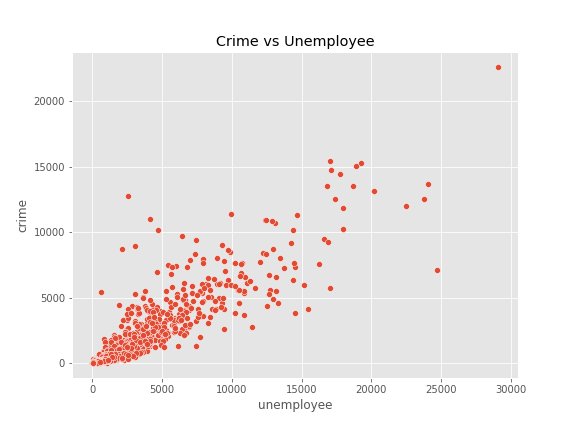
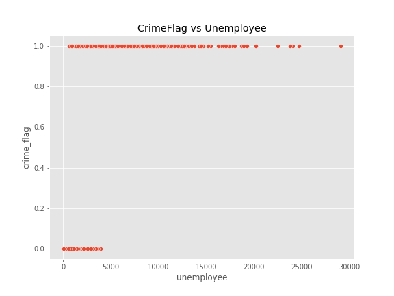
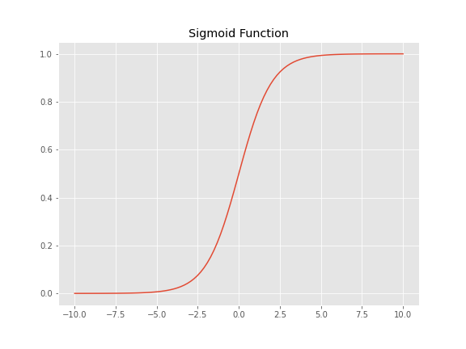
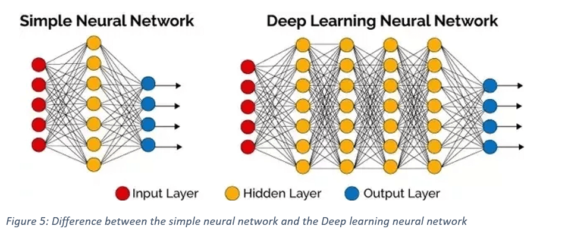

# はじめに

本資料は「機械学習とは何か？」という疑問からスタートし、機械学習に関する周辺知識の中でも実務に直結するものを中心に取り扱う。  
本資料のゴールは、ハンズオンを通して与えられたデータから機械学習モデルを作成・運用に乗せるまでの一連の流れを掴むこと。  

## 本資料で扱うこと

- 機械学習のイメージを掴むための日本語の説明
- 機械学習の理屈を理解するための最低限の数式

## 本資料で扱わないこと

- pythonの文法
- 各種ライブラリの使い方

# 機械学習とは何か？

## AIとは

機械学習の話に入る前に、昨今機械学習とニコイチで扱われる人工知能 (Artificial Intelligence; AI) について触れておく。  

- 映画等におけるAIの2種類の描かれ方
    1. 自律して動き回るロボットとして
    1. コンピュータのプログラムとして

|#|名称|出典|備考|
|---|---|---|---|
|1|スカイネット|ターミネーター|自我に目覚めたコンピュータ|
|2|ドラえもん|ドラえもん|猫型ロボット|
|3|C-3PO|スターウォーズ|多言語を理解して二足歩行するドロイド（ロボット）|
|4|レッドクイーン|バイオハザード|研究施設を制御するメインコンピュータ|

ゆえにAIとロボットは混同されがちだが、この2つは明確に異なっている。  
松尾豊『人工知能は人間を超えるか』によれば、ロボットの脳に該当する部分がAIである。  

ただし、AIの定義は専門家の間でも異なっている。  

|専門家|定義|
|---|---|
|中島秀之 公立はこだて未来大学学長|人工的につくられた、知能を持つ実体。あるいはそれをつくろうとすることによって知能自体を研究する分野である|
|西田豊明 京都大学大学院情報科学研究科教授|「知能を持つメカ」ないしは「心を持つメカ」である|
|溝口理一郎 北陸先端科学技術大学院大学教授|人工的に作った知的な振る舞いをするもの（システム）である|
|長尾真 京都大学名誉教授 前国立国会図書館長|人間の頭脳活動を極限までシミュレートするシステムである|
|堀浩一 東京大学大学院工学系研究科教授|人工的につくる新しい知能の世界である|
|浅田稔 大阪大学大学院工学研究科教授|知能の定義が明確でないので、人工知能を明確に定義できない|
|松原仁 公立はこだて未来大学教授|究極には人間と区別がつかない人工的な知能のこと|
|武田秀明 国立情報科学研究所教授|人工的につくられた、知能を持つ実体。あるいはそれをつくろうとすることによって知能自体を研究する分野である（中島氏と同じ）|
|池上高志 東京大学大学院総合文化研究科教授|自然にわれわれがペットや人に接触するような、情動と冗談に満ちた相互作用を、物理法則に関係なく、あるいは逆らって、人工的につくり出せるシステムを、人工知能と定義する。分析的にわかりたいのではなく、会話したり付き合うことで談話的にわかりたいと思うようなシステム。それが人工知能だ|
|山口高平 慶應義塾大学理工学部教授|人の知的な振る舞いを模倣・支援・超越するための構成的システム|
|栗原聡 電気通信大学大学院情報システム学研究科教授|工学的につくられる知能であるが、その知能のレベルは人を超えているものを想定している|
|山川宏 ドワンゴ人工知能研究所所長|計算機知能のうちで、人間が直接・間接に設計する場合を人工知能と呼んでよいのではないかと思う|
|松尾豊 東京大学大学院工学系研究科准教授|人工的につくられた人間のような知能、ないしはそれをつくる技術|

出典：松尾豊『人工知能は人間を超えるか』

また、計算機知能 (Computational Intelligence; CI) のメジャーな教科書であるPoole et al (1998) では、AIとは計算機知能の研究分野につけられた通称に過ぎず、計算機知能とは周囲の環境にあわせて経験から学習し、目標達成のために行動するシステムであると定義されている。  
このように、AIについての明確な定義は存在していない。  

## 「強いAI」と「弱いAI」

AIに関する議論の1つに「強いAI」と「弱いAI」の議論がある。  
- 1980年にアメリカの哲学者ジョン・サールが提唱した  
- Searle (1980) では、心や脳の研究おいて人間の認知能力をコンピュータでシミュレーションするにあたり、2種類のAIを区別するのが良いと述べられている  

1. 弱いAI (Weak AI)  
    仮説検証に用いることができるツール
2. 強いAI (Strong AI)  
    単なる仮説検証のツールに留まらず、心を持ち、物事を理解し、認知能力を持つ適切にプログラムされたコンピュータ

「強いAI」と「弱いAI」の例に用いられるのが、Searle (1980) で述べられている「中国語の部屋」という例え話。  

- 中国語の読み書きはできないが英語の読み書きはできる人に英語で書かれた規則集を渡しておく  
- その上で彼に中国語で書かれた質問文を渡す  
- 中国語が読めない彼にとって、質問文はただの記号の羅列に過ぎない  
- しかし彼が持っている規則集には「これこれの記号の羅列にはこんな記号の羅列で返すように」と指示が書かれている  
- 彼は規則集を調べて該当した指示の通りに記号の羅列を書いて回答する  
- 一見すると彼は中国語の文章でやり取りをしているように見えるが、果たして中国語を理解していると言えるだろうか？  

この分類は後に支持され、AIのメジャーな教科書であるRussell and Norvig (2003) では以下のように定義されている。

1. 弱いAI (Weak AI)  
    思考しているかのように振る舞う機械
2. 強いAI (Strong AI)  
    実際に思考する機械

なお、アメリカの実業家レイ・カーツワイルは著書 "The Singularity is Near (2005)" において、強いAIを「人間と同等の知性を持った機械」として述べているが、これは本来の強いAIの定義とは異なり「汎用型AI」に近い定義。

## 「汎用型AI」と「特化型AI」

AIの分類に関するもうひとつの議論が「汎用型AI」と「特異型AI」である。  

1. 汎用型AI (Artificial General Interigence; AGI)  
    人間と同じように認知能力を持ち、言語を理解したり学習したり、知的な活動を行うエージェント（システム）
2. 特化型AI (Narrow AI)  
    特定の問題解決のために設計されたプログラム

映画などによく登場するのは汎用型AIであるが、2022年現在ではまだ実現していない。  
昨今話題となっているものは全て特化型AI。  

ちなみに、レイ・カーツワイルはその著書の中で2029年には汎用型AIに相当するものが実現すると予想している。

## 機械学習とは

機械学習のメジャーな教科書であるMitchell (1997) によれば、機械学習とは経験を通してコンピュータに自ら学ばせる技術として定義される。

そして、AIと機械学習の関係については、一般にAIという概念のサブセットが機械学習と言われることが多い。

出典：DataRobot AI Experience 2017 https://www.youtube.com/watch?v=ZChA63CpX5o

しかし、AIと機械学習の関係も明確な定義は定まっていない。  
例えばDataRobot 創業者のJeremy Achin は次のように定義している。  

出典：DataRobot AI Experience 2017 https://www.youtube.com/watch?v=ZChA63CpX5o

少なくとも言えることは以下２つ。
- AIを実現する手法の1つが機械学習だということ  
- 近年では機械学習の成果が他の手法に比べて圧倒的なことから、AIと機械学習がほぼ同義のように扱われているということ  

## AIの歴史

機械学習が注目されている理由は、AIの歴史を振り返るとはっきりする。  
なお、AIの歴史は松尾豊『人工知能は人間を超えるか』に分かりやすく述べられている。

### 第1次AIブーム

- 1956~1974
- 切っ掛け
    - ダートマス会議
- 中心技術
    - 探索木
        - 原始的な決定木
        - 記号主義者
    - 単純パーセプトロン
        - 超初期のニューラルネットワーク
        - コネクショニスト
- ブームの終わり
    - 探索木では迷路やパズルなど特定の問題しか解けない  
        &rarr; 現実的な問題は解けない
    - 単純パーセプトロンではXOR関数を表現できない  
        &rarr; やはり単純な問題しか解けない
        - 論理演算の復習
            - 例えば、「男性・女性」「若者・高齢者」の2軸でマトリックスを作る  
                &rarr; 若い男性、高齢の男性、若い女性、高齢の女性
        - 論理積
            - 女性 AND 若者 &rarr; 「女性かつ若者」= 若い女性
        - 論理和
            - 女性 OR 若者 &rarr; 「女性または若者」= 若い女性、高齢の女性、若い男性
        - 否定
            - NOT 女性 &rarr; 「女性」の否定 = 若い男性、高齢の男性
        - 否定論理積
            - 女性 NAND 若者 &rarr;「女性かつ若者」の否定 = 若い男性、高齢の男性、高齢の女性
        - 否定論理和
            - 女性 NOR 若者 &rarr; 「女性または若者」の否定 = 高齢の男性
        - 排他的論理和
            - 2つの命題のうち片方だけが真の場合に真となる
            - 女性 XOR 若者 &rarr; 「女性で若者でない、または女性でなくて若者」 = 高齢の女性、若い男性

### 第2次AIブーム

- 1980~1987
- 切っ掛け
    - 記号主義者と知識工学の接近
- 中心技術
    - エキスパートシステム
        - 人間の専門知識をひたすらプログラム化したシステム
        - 入力に対してルールベースで該当した知識を返す  
            &rarr; 現実的な問題でも解けるようになった
        - 要するにルールベースの怪物
- ブームの終わり
    - 専門知識のプログラム化に終わりがない  
        &rarr; エキスパートシステムが肥大化しすぎて管理運用できない
    - フレーム問題  
        &rarr; ルールベースで専門知識を検索するのは良いが、検索範囲をどう絞るか
    - シンボルグラウンディング問題  
        &rarr; コンピュータが扱う記号・数値を現実の意味とどう結びつけるか  
            cf. シニフィエとシニフィアン、中国語の部屋

### 第3次AIブーム

- 2006~現在
    - ディープラーニングが衝撃を与えた2012年以降を第4次AIブームとして区別するなど諸説あり
- 切っ掛け
    - オートエンコーダ
        - 自ら特徴を見つける表現学習 (representation learning/feature learning)
- 中心技術
    - ディープラーニング
        - オートエンコーダによる表現学習
            - 自ら特徴を見つけて学習する
        - 多層パーセプトロン
        - コネクショニスト
- 火付け役
    - AlexNet (2012)
    - Googleの猫 (2012)
- ブームの燃料
    - インターネットの普及
    - 大規模データの処理環境整備
    - マシンスペックの向上
    - 並列処理技術の向上

### 機械学習が注目されている理由

- ディープラーニングは自ら特徴を見つけることができる  
    &rarr; フレーム問題・シンボルグラウンディング問題解決の糸口となっている
- その他の機械学習手法も自らデータ中のパターンを見つけることができる  
    &rarr; 専門知識の終わりなきプログラム化から解放された

## 機械学習の主要学派

ペドロ・ミンゴス著『マスターアルゴリズム』によれば、主要な機械学習アルゴリズムの学派は以下の5つ。

### コネクショニスト (Connectionist)

- 手法
    - ニューラルネットワーク
    - ディープラーニング
- 活躍分野
    - 表現学習
    - 画像認識
    - 音声認識
    - 自然言語処理
        - 文書分類
        - 機械翻訳
    - 画像生成
    - 音声生成
    - 文章生成
    - 強化学習

### 記号主義者 (Symbolist)

- 手法
    - 決定木
    - ツリー系アルゴリズム
        - XGBoost
        - LightGBM
        - CatBoost
- 活躍分野
    - テーブルデータのパターン認識
        - 分類問題
        - 回帰問題

### 進化主義者 (Evolutionalist)

- 手法
    - 遺伝的アルゴリズム
    - 遺伝的プログラミング
    - Eureqa
- 活躍分野
    - 系列データ生成過程の推定
        - 方程式の同定
    - 強化学習
        - マルチエージェント学習
        - プログラム生成

### ベイズ主義者 (Bayesian)

- 手法
    - ベイズ推定
        - ナイーブベイズ
- 活躍分野
    - 文書分類
    - データ生成過程の推定
        - 統計モデル
        - 時系列分析

### 類推主義者 (Analogizer)

- 手法
    - k-近傍法
    - サポートベクターマシン
- 活躍分野
    - AlexNet以前の画像認識
    - XGBoost以前のテーブルデータのパターン認識
    - アンサンブルモデルの素材

# モデルとは

## モデルの定義

機械学習の文脈で頻出するモデルという単語は「数理モデル」の意味で使用されている。  
江崎 (2020) によれば、数理モデルとは次のように定義される。

> 数理モデルとは、数学的な手段を用いて記述された、対象のデータ生成ルールを模擬したもの

## 主なモデルの種類

江崎 (2020) によれば、数理モデルはその用途から2種類に分けることができる。  

1. 理解指向型モデリング  
    データがどういうメカニズムで生成されているのかを理解することが目的
2. 応用指向型モデリング  
    手元にあるデータをもとに、未知のデータに対して予測・制御を行なったり、新しいデータを生成して利用することが目的

代表的な数理モデルには以下のようなものがある。

- 線形モデル
    - 線形モデルとは、変数同士の関係を線形結合（足し算、引き算、定数倍）で表したもの
    - 例えば変数\\(x, y\\)とパラメータ\\(a, b\\)を用いた次の式
\\[
y = ax + b
\\]
    - この式において、$x$を説明変数もしくは独立変数といい、$y$を被説明変数もしくは目的変数という
    - 特に機械学習の文脈では説明変数のことを特徴量、被説明変数のことをターゲットと呼ぶ
- 微分方程式
    - 微分の復習
      - 微分とは変数$x$が変化したときの関数$f(x)$の変化率
\\[
\frac{d}{dx}f(x) = \lim_{h \to 0} \frac{f(x+h)-f(x)}{h}
\\]
    - 微分方程式とは、ある変数の変化に伴って見たい変数がどう変化するかを表したもの
    - 例えばマルサスの成長モデル（人口論）
        - \\(N\\)は人口を表す変数、\\(t\\)は時間を表す変数、\\(r\\)は定数とする
        - 時の経過に伴い人口がどう増減するかを表したモデル  
\\[
\frac{dN}{dt} = rN
\\]
        - 人口が多ければその分だけ生まれてくる子供も多いはず  
            &rarr; 人口の変化率はその時点での人口に比例するはず
- 統計モデル
    - 統計モデルとは、確率変数を用いて、得られたサンプルデータからその生成過程を表したもの
    - 例えば変数$x, y$とパラメータ$a, b$に加え、確率変数$\varepsilon$を用いた次のモデル    
\\[
\begin{align}
y = ax + b + \varepsilon \cr
\varepsilon \sim N(0, \sigma^2)
\end{align}
\\]
    - ただし、$\varepsilon \sim N(0, \sigma^2)$は確率変数$\varepsilon$が平均$0$ 分散$\sigma^2$の正規分布に従うことを表す  
    - 確率変数$\varepsilon$は誤差項と呼ばれるが、その意味するところは「予測値と実測値の差」ではなく「変数$x$で説明できないその他の要因」
- Box-Jenkins法
    - Box-Jenkins法とは、時系列分析における古典的アプローチを体系化したもの  
    - 所謂ARIMAモデルやその発展モデル

以上の数理モデルは、データの生成過程を理解したいシーンでよく登場するので「理解指向型モデリング」と言える。  
ただし、これらのモデルを予測に用いても何ら問題はなく、「理解指向型モデリングでは予測ができない、予測しても精度が悪い」と断言するのは誤り。

- 機械学習モデル
    - 機械学習モデルとは、機械学習アルゴリズムを用いた数理モデルの総称
    - 主な機械学習アルゴリズムは以下の通り
        - ディープラーニング
        - ツリー系アルゴリズム
        - ナイーブベイス
        - 遺伝的プログラミング
        - k-近傍法
        - サポートベクターマシン

ディープラーニングやツリー系アルゴリズムを筆頭に、機械学習モデルはデータから予測をしたり機械制御したり、とにかくアウトプットを生成したいシーンでよく登場するので「応用指向型モデリング」と言える。  
ただし、ベイズ推定を用いたモデル（階層ベイズや状態空間モデルなどのベイジアンモデル）は統計モデルとして扱われることが多く、明確に線引きをすることは難しい。  
（と言うより、ベイジアンモデルは機械学習モデルか統計モデルか、という線引き自体にあまり意味がない）  
さらに、説明可能なAI (Explanable AI; XAI) という研究分野は、機械学習モデルからなぜそのアウトプットが出てくるのか過程を理解できるようにすることを目指している。  
    cf. Permutation Importance, Partial Dependence, SHAP, Class Activation Mapping  
そのため、「応用指向型モデリングは完全なブラックボックス」と断言するのは誤り。  

## 一般的なモデル作成手順

ここでは線形回帰を例にモデル作成手順を説明する。  
複雑なモデルを作る場合には工程が増えることもあるが、一般的には以下の流れでモデルを作成する。

### 探索的データ解析

探索的データ解析 (Explanatory Data Analysis; EDA) とは、記述統計や可視化を通じてデータを理解しようとするアプローチのこと。  

- どんなデータでも必ずこれをやれば勝てる、という手法はない
- よく使われる手法は以下の通り
    - 記述統計
        - 単変量
            - 平均、分散、中央値
        - 多変量
            - クロス集計
            - 分散共分散行列（相関係数行列）
    - 可視化
        - 散布図
        - ヒストグラム
        - カーネル密度推定
        - 箱ひげ図 (Box plot)
        - 折れ線グラフ
        - ベン図
    - 次元削減
        - 主成分分析 (Principal Component Analysis; PCA)
        - 特異値分解 (Singular Value Decomposition; SVD)
    - 高次元データの可視化
        - t-SNE
        - UMAP

### 問題の定式化

- 特徴量エンジニアリング
    - 今ある特徴量から新しい特徴量を作り出すこと
        - 特徴量同士の積
        - EDAで見つけたインサイトを盛り込む
        - ドメイン知識を基にフラグを立てる
- 仮説構築
    - 特徴量とターゲットの関係について仮説を立てる
    - 例えば$n$個のサンプルについて変数\\(x, y\\)の実測値を集めたとする
    - $i$番目の実測値\\(y_i\\)を、変数\\(x_i\\)とパラメータ\\(\beta_0, \beta_1\\)、確率変数\\(\varepsilon_i\\)を用いて表す  
\\[
\begin{align}
y_i = \beta_0 + \beta_1x_i + \varepsilon_i \cr
\varepsilon_i \sim N(0, \sigma^2)
\end{align}
\\]

### 損失関数の定義

- モデルの形を決めたので、次はモデルに含まれるパラメータを求めたい
    - 歴史的理由から、モデルの形を仮説 (hypothesis) と呼ぶ
- 良いモデルであれば実測値と予測値の差が小さいはず
- 従って、次を最小にするようなパラメータ$\beta_0, \beta_1$を求めれば良い
\\[
\begin{align}
\frac{1}{n}\sum_{i=1}^{n} \{y_i - (\beta_0 + \beta_1x_i + \varepsilon_i)\} = \frac{1}{n}\sum_{i=1}^{n} (y_i - \beta_0 - \beta_1x_i)
\end{align}
\\]
- ただし、誤差項\\(\varepsilon_i\\)は平均$0$なので消える
- 計算を楽にするため2乗したものを平均二乗誤差 (Mean Squared Error; MSE) と呼ぶ
\\[
\begin{align}
\frac{1}{n}\sum_{i=1}^{n} (y_i - \beta_0 - \beta_1x_i)^2
\end{align}
\\]
- さらにこれの平方根を取ったものを二乗平均平方根誤差 (Root Mean Squared Error; RMSE) と呼び、MSEの代わりにRMSEを用いることもある
- このように最小化したい対象を損失関数 (Loss Function) やコスト関数 (Cost Function) と呼ぶ
- その他の主な損失関数
    - 交差エントロピー誤差 (Logarithmic Loss; Log Loss)
        - 分類問題で用いる

### 最適化手法の選択

- モデルのパラメータを求めるためには、損失関数を最小化する問題を解けば良い
- 基本的には最小化問題なので、微分して$=0$と置いて方程式を解けば良い
- 基本となる最適化手法
    - 最小二乗法 (Ordinary Least Squares)
    - 勾配降下法（最急降下法, Gradient Descent）
- その他の最適化手法
    - ニュートン法
    - LBFGS
    - 座標降下法 (Coordinate Descnt)
    - 確率的勾配降下法 (Stochastic Gradient Descnt)
    - ミニバッチ勾配降下法
    - Momentum SGD
    - Adam
- 特にディープラーニングでは色々な手法が研究されている
    - Adamが定番

### フィッティング

- フィッティングとは仮説にデータを当てはめること
- 具体的には立てた仮説に沿って、損失関数の最小化問題を選択した最適化手法で解いて、パラメータを求めること
- フィッティングのことを学習とも呼ぶ

# 分類問題

分類問題とはYes/No, Positive/Negative のような2択を判別させる問題のこと。  
次のようにターゲットを数字に置き換えて問題を解く。  
- Positive &rarr; 1
- Negative &rarr; 0

治安の悪さと失業者数の例を分類問題として扱ってみる。  

前章で、刑法犯認知件数を$crime$ 完全失業者数を$unemp$として
\\[
\begin{align}
crime_i = \beta_0 + \beta_1unemp_i + \varepsilon \cr
\varepsilon \sim N(0, \sigma^2)
\end{align}
\\]
という線形回帰モデルを作成した。  
線形回帰モデルの作成は以下の流れで行った。  
- 仮説構築
    - 治安の悪さと失業者数には関係がある
    - 治安の悪さの代理変数として、刑法犯認知件数を用いる  
- 損失関数定義
- 損失関数を最小化するパラメータを求める
    - 最小二乗法
    - 勾配降下法
- 結果
    - 決定係数0.81の線形回帰モデルが出来上がった
- 結論
    - 刑法犯認知件数は完全失業者数で説明できる  
        &rarr; したがって、治安の悪さと失業者数には関係があると考えられる  
        ※ちゃんと分析するなら「市町村ごとの総人口の違いは考慮しなくて良いの？」というツッコミが入るが、ここではひとまず置いておく

ここで、「治安の悪さの代理変数として、刑法犯認知件数を用いる」という部分を掘り下げて、次のような仮説を考えてみる。  
- 新たな仮説
    - 刑法犯認知件数に閾値を定めて、それ以上なら治安が悪い、それ未満なら治安が良い、という2択にすれば、失業者数から治安の良し悪しをもっとはっきり判別することができるのではないか

仮に刑法犯認知件数の閾値を1,838市町村の平均数として、刑法犯認知件数がそれ以上の市町村は治安が悪い、それ未満の市町村は治安が良いと判断するフラグを立てる。
- 治安が悪い &rarr; 1  
- 治安が良い &rarr; 0  

  

新しく立てたこのフラグを$crime\_flag$とする。  
- $crime\_flag=1$  
    &rarr; 481市町村  
- $crime\_flag=0$  
    &rarr; 1,357市町村  

すると、相手にするのがこの散布図から  
  
この散布図に変わる。  
  

ここに今まで通り線形回帰を適用しても全然うまく当てはまらない。  
  

さらに、試しに失業者数の上位5市町村を除いてみる。  
すると散布図はこうなる。  
  

この状態で線形回帰を適用すると、決定境界の青い点線が簡単に左にズレる。  
  

&rarr; 分類問題を解くためには、線形回帰ではない別の方法が必要。

## シグモイド曲線

分類問題を解くときに頻出するのがシグモイド曲線。  
シグモイド曲線とは必ず0~1の間に収まる魔法の曲線。  

この曲線を描く式は次の関数で定義される。  
\\[
\begin{align}
S(x) = \frac{1}{1 + e^{-x}} = \frac{e^x}{e^x + 1}
\end{align}
\\]
この関数をシグモイド関数と呼ぶ。  
&rarr; シグモイド関数に突っ込めば、どんな値でも0~1の間に収まる。

## ロジスティック回帰

乱暴な言い方をすれば、ロジスティック回帰とは線形回帰式の出力にシグモイド関数を噛ませて確率として扱えるようにしたモデル。
\\[
\begin{align}
y\in\{0, 1\} \cr
z = \beta_0 + \beta_1x \cr
P(Y=y) = \frac{1}{1+e^{-z}}
\end{align}
\\]

ただし、$y$は$0$か$1$の値をとる確率変数で、$Y$はその実現値とする。  
$P(Y=0)$は確率変数$y$が$0$をとる確率、$P(Y=1)$は確率変数$y$が$1$をとる確率を表す。  
そして、これらをまとめて確率変数$y$の関数として表記したものを確率関数と呼び、$p(y)=P(Y=y)$と表記する。  
&rarr; ロジスティック回帰は確率を扱える

- 理論面を掘り下げようとすると一般化線形モデルが出てくるが、時間がないのでその辺りはまた後日  
    - 一般化線形モデルについては久保 (2012) が定番の教科書
        - 通称「緑本」
- ロジスティック回帰を機械学習モデルとするか統計モデルとするかは主義・流派によって異なる
    - 線引きすること自体にあまり意味はない
- ロジスティック回帰自体はかなり古くからあるアルゴリズム
- では時代遅れのロートルか？  
    &rarr; No!  
    &rarr; 今でも通用する  
        - DataRobotはじめ各種AutoMLサービスが最初に走らせるアルゴリズムのひとつ
- ロジスティック回帰のすごいところ
    - シンプルなところ
        - シンプルゆえに計算が速い
        - シンプルゆえに解釈しやすい

このロジスティック回帰を用いて、分類問題を解いていく。  
作成するモデルは以下の通り。  

- 仮説
    - 治安が良いか悪いかを失業者の数から判別する
    - 治安が良ければ$y=0$、治安が悪ければ$y=1$として、完全失業者数を$unemp$とする
    - $P(Y=y)$がモデルから予測される確率になる
\\[
\begin{align}
y\in\{0, 1\} \cr
z = \beta_0 + \beta_1unemp \cr
P(Y=y) = \frac{1}{1+e^{-z}}
\end{align}
\\]

- ロジスティック回帰の損失関数
    - 分類問題なのでLog Loss
    - モデルから予測される確率$P(Y=y)$を$p$とおく
    - $n$をサンプルサイズとする
\\[
\begin{align}
J(\beta) = -\frac{1}{n} \sum_{i=1}^{n}\\{ y_i \log p_i + (1-y_i)\log (1-p_i)\\}
\end{align}
\\]

この損失関数を最小にするようなパラメータを勾配降下法で求める。

# 非線形問題

## 線形とは

今までさり気なく使っていた「線形」という言葉の意味を定義する。  
なお、「線型」と書かれることもあるが意味は同じで、どちらもlinearの訳語。  
どちらの漢字を使うかはその人の趣味や思想による。  

- 線形とは線形性のこと  

線形性の定義は以下の通り。  
- $\alpha$を任意の定数として関数$y=f(x)$が以下を満たすとき、関数$y=f(x)$は線形性を持つ  
    - $f(x_1+x_2) = f(x_1)+f(x_2)$  
    - $f(\alpha x) = \alpha f(x)$  

&rarr; 足し算、引き算、定数倍だけで定義できるかどうか。  

例えばこんな関数。  
$y=2x+1$  
&rarr; 足し算と定数倍で定義されている
  

足し算、引き算、定数倍だけでは定義できないものは非線形。  
例えばこんな関数。  
$y=2x^2+1$  
&rarr; 変数同士の掛け算を使って定義されている  
  

- 注意
    - 以下のようなモデルも線形モデルと呼ばれる
        - $y=\beta_0 + \beta_1x_1 + \beta_2x_2 + \beta_3x_1x_2$
        - $y=\beta_0 + \beta_1x_1 + \beta_2x_1^2$
    - 確かに変数$x$視点で見れば掛け算が入っているので非線形
    - 一方、パラメータ$\beta$視点で見れば足し算と定数倍だけなので線形  
        &rarr; なので線形モデル

## 非線形問題

例えばこんな3列構成のデータセットが2つあったとする。  
- １列目：feature #0
- ２列目：feature #1
- ３列目：target (0 or 1)
- サンプルサイズ：2,000

  

- データセットA  
    - 直線を1本引けば0と1を分離できそう  
        &rarr; 線形分離可能
- データセットB
    - どんな直線を引いても1本では0と1を分離できなさそう  
        &rarr; 線形分離不可能  
        &rarr; 非線形問題

分類結果は以下の通り。  
ただし、2,000サンプルを6:4で分割し、前者で学習、後者でテストを行っている。  
各プロット右下の数字はテスト結果のAccuracyを記載している。  
  

## 非線形問題への対応

データセットBを分類しようと思ったときに、よくある対応方法は以下の通り。  
- 非線形関数で当てはめる  
    - データセットBに対して$ax^2+by^2=0$というモデルの形を仮定する
- 非線形関数を噛ませて線形関数を合成する
    - 2つの線形関数を合成する
        - $f(x)=ax+b$
        - $g(x)=cx+d$  
            &rarr; $f(g(x)) = f(cx+d) = acx+ad+b$  
            &rarr; これだけだと合成後も線形関数  
    - 線形関数の出力に非線形関数を噛ませてから合成する
        - $f(x)=ax+b$
        - $g(x)=cx+d$
        - $S(x)=\frac{1}{1+e^{-x}}$  
            &rarr; $Z=S(f(x))=\frac{1}{1+e^{-(ax+b)}}$  
            &rarr; $g(Z)=cZ+d=\frac{c}{1+e^{-(ax+b)}}+d$  
            &rarr; 一気に複雑な非線形関数ができた  
    - これを延々繰り返すのがニューラルネットワーク
- そもそも関数近似しない  
    - 決定木  
        &rarr; 条件分岐
- 確率分布を考える
    - ナイーブベイズ  
- 距離が近いもの同士でまとめる
    - k-近傍法
- カーネルトリック
    - サポートベクターマシン  

# ディープラーニングさわり

## ニューラルネットワーク

ディープラーニングとは隠れ層を数十〜数百に深くしたニューラルネットワークのこと。  
単純に深くしただけだと様々な問題が出てくるので、色々と工夫されている。  
  

## なぜディープラーニングが注目されているのか

- 表現学習 (Representation Learning)
    - 特徴量エンジニアリングで人が特徴量を作り出さなくても良い  
  
    - ディープラーニングは自ら特徴を学習することができる
  

- 非構造化データに強い  
  
  
  
  

出典：DataRobot Community [アーカイブ] DL入門とDataRobot Visual Artificial Intelligence(AI)

## 有名なネットワーク

4系統のネットワークに分けられる。
- FNN (Feed-forward Neural Network)  
    &rarr;  一方通行のネットワーク  
    - DNN(Deep Neural Network),  ANN (Artificial Neural Network), MLP (Multi Layer Perceptron)  
        &rarr; いずれも全結合層を深くした単純なネットワーク  
        - 全ての基本
        - シンプルすぎてこれ単体で実務で使うことはない  
  

- RNN (Recurrent Neural Network)  
    &rarr; 系列データを扱うネットワーク  
    &rarr; 自然言語、音声分野で用いられる
  
    - Simple RNN  
        &rarr; 時点$t-1$の出力を時点$t$の入力に含める  
        - 時間軸が進むにつれてどんどん更新されるので時点$t-10$とかの情報が考慮されない  
        &rarr; 記憶能力が弱い  
        - 教科書を開くと最初に出てくるが、実務では使われない
    - LSTM (Long Short Term Memory)  
        &rarr; 長期記憶と短期記憶を持たせたネットワーク  
        - Transformer登場以降、実務ではあまり使われない
    - GRU (Gated Reccurent Unit)  
        &rarr; 長期記憶を持たせたネットワーク  
        - Transformer登場以降、実務ではあまり使われない  
  

- CNN (Convolutional Neural Network)  
  
    &rarr; 畳み込み層 (Convolution Layer) と呼ばれる層で特徴抽出を行う  
    &rarr; 画像分野で用いられる  
    - シンプルなCNNは実務では使われない  
    - RNN同様、今後Transformer系にとって変わられるかも
    - 実務で使われるCNNの例
        - EfficientNet
        - ResNet  
  

出典：He et al (2015) "Deep Residual Learning for Image Recognition"

  

- Transformer系  
    &rarr; Attension機構と呼ばれる層でどこに注目すれば良いかを学習するEncoder-Decoderモデル  
    &rarr; 元々は機械翻訳で登場したが、色々なタスクでState of the Art  
    &rarr; 自然言語の分野ではRNNにとって変わった  
    &rarr; 今後、画像分野でもCNNにとって変わるかもしれない  
    - Transformer
    - GPT
    - BERT
    - Vision Transformer (ViT)  
  

出典：Vaswani et al (2017) "Attension Is All You Need"

  

# ツリー系アルゴリズム

ツリー系アルゴリズムとは決定木をベースにしたアルゴリズムの総称。  
ディープラーニングとは対照的に構造化データに強い。

## 決定木

決定木 (Decision Tree) とは、以下3種類のアルゴリズムの総称。  
- CART
- CHAID
- ID3 &rarr; C4.5 &rarr; C5.0  

いずれも次のような樹形図を描くので、決定木と呼ばれる。  
  

出典：https://github.com/rasbt/python-machine-learning-book-2nd-edition/blob/master/code/ch03/images/03_21.png

3種類のアルゴリズムの比較は以下の通り。  
  

出典：http://www.analyticsdlab.co.jp/column/decisiontree.html

- よく使われるのはCART
    - カテゴリ変数・連続変数を気にしなくて良い
    - 2分岐なので計算が速い

## アンサンブル

アンサンブル (Ensemble) とは複数のモデルを組み合わせる手法。  
- 弱学習器
    - 組み合わせる個々のモデル
    - アンサンブル素材
- 強学習器
    - 組み合わせた結果のモデル全体のこと
    - 最終的な出力を行う  

組み合わせ方によって、大きく以下5通りに分けられる。  
- Voting  (Hard Voting)  
    &rarr; 多数決をとる
    - 元のデータセットから複数の弱学習器を作る
    - 弱学習器の出力の多数決で最終的な出力を決める  
        &rarr; NERVのマギシステム
        &rarr; ぶっちゃけ実務では使わない
- Averaging  (Soft Voting)  
    &rarr; 平均をとる
    - 元のデータセットから複数の弱学習器を作る
    - 弱学習器の出力の平均を最終的な出力とする  
        &rarr; 弱学習器に多様性があった方が最終的な出力の精度は良くなる  
        &rarr; 三人寄れば文殊の知恵
        &rarr; めちゃくちゃよく使う
- Stacking  
    &rarr; 部下が上申して決裁者が意思決定する
    - 元のデータセットから複数の弱学習器を作る
    - 弱学習器の出力を特徴量として機械学習モデルを作る
    - その出力を最終的な出力とする  
        &rarr; うまく使えれば強力だが、強学習器を作るときに気をつけないと失敗する  
        - リーケージ
- Bagging (Bootstrap Aggrigating)  
    &rarr; サンプリングして大量にデータセット増やす
    - 元のデータセットから重複を許して復元抽出により大量のデータセットを作る
    - 各データセットにつき1つの弱学習器を作る
    - 弱学習器の出力を平均して最終的な出力とする  
        &rarr; ブートストラップ平均でバリアンス抑える効果がある  
        &rarr; 精度が上がるというよりは、汎化性能が上がる
- Boosting  
    &rarr; 間違えたところを重点的に復習する  
    - 復習の仕方で異なる2種類の実装方法
        - AdaBoost (Adaptive Boost)  
            - 元のデータセットから1つ目の弱学習器を作る
            - 1つ目の弱学習器が誤分類したサンプルだけ抽出して2つ目の弱学習器を作る
            - 2つ目の弱学習器が誤分類したサンプルだけ抽出して3つ目の弱学習器を作る
            - これを延々繰り返す
            - 各弱学習器の出力の重み付き和を最終的な出力とする
        - 勾配ブースティング (Gradient Boosting)
            - 元のデータセットから1つ目の弱学習器を作る
            - 1つ目の弱学習器の出力の残差を計算する
            - 元のデータセットの特徴量を用いて、1つ目の弱学習器の残差をターゲットにして2つ目の弱学習器を作る
            - 2つ目の弱学習器の残差を計算する
            - 元のデータセットの特徴量を用いて、2つ目の弱学習器の残差をターゲットにして3つ目の弱学習器を作る
            - 3つ目の弱学習器の残差を計算する
            - これを延々繰り返す
            - 各弱学習器の出力の重み付き和を最終的な出力とする  
    &rarr; 勾配ブースティングが頻出

## 主要なツリー系アルゴリズム

### ランダムフォレスト

https://www.slideshare.net/HitoshiHabe/ss-58784421

### 勾配ブースト木

### XGBoost

### LightGBM

### CatBoost

# データ前処理

## 数値変数の前処理

### 標準化

### 正規化

### 対数変換

## カテゴリ変数の前処理

### One-Hot エンコーディング

### Ordinal エンコーディング

### Target エンコーディング

# バリデーションスキーム

## ホールドアウト

## クロスバリデーション

## データの分け方

### K-fold

### Stratified K-fold

### グループパーティション

### タイムシリーズパーティション

# モデルの評価

## バイアスとバリアンス

## 学習曲線

## 評価指標

## 混同行列

## 残差分析

# ハイパーパラメータのチューニング

## ハイパーパラメータとは

## グリッドサーチ

## ランダムサーチ

## ベイズ最適化

# 参考文献

- D. Poole, A. Mackworth and R. Goebel (1998) "Computational Intelligence: A Logical Approach", New York: Oxford University Press.
- T. Mitchell (1997) "Machine Learning", New York: McGraw Hill.
- ペドロ・ミンゴス著, 神嶌敏弘訳 (2021) "マスターアルゴリズム：世界を再構築する「究極の機械学習」", 講談社
- 松尾豊 (2015) "人工知能は人間を超えるか：ディープラーニングの先にあるもの", KADOKAWA
- John. R. Searle (1980) "Minds, brains, and programs", Behavioral and Brain Sciences 3 (3), pp.417-457
- S. Russell and P. Norvig (2003) "Artificial Intelligence: A Modern Approach", Upper Saddle River, New Jersey: Prentice Hall.
- 江崎貴裕 (2020) "データ分析のための数理モデル入門：本質をとらえた分析のために", ソシム
- 竹村彰通 (2020) "新装改訂版 現代数理統計学", 学術図書
- 加藤公一 (2018) "機械学習のエッセンス", SBクリエイティブ
- 久保拓弥 (2012) "データ解析のための統計モデリング入門：一般化線形モデル・階層ベイズモデル・MCMC", 岩波書店
- 荒木修・齋藤智彦 (2016) "本質から理解する 数学的手法", 裳華房
- Sebastian Raschka, Vahid Mirjalili著, 株式会社クイープ訳, 福島真太朗監訳 (2018) "[第2版] Python機械学習プログラミング：達人データサイエンティストによる理論と実践", インプレス
- K. He, X. Zhang, S. Ren and J. Sun (2015) "Deep Residual Learning for Image Recognition", arXiv:1512.03385 